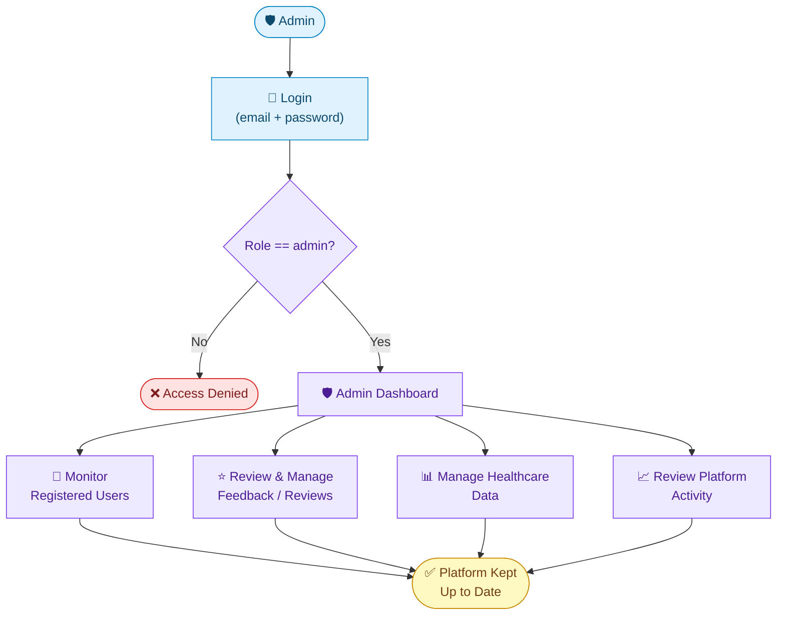
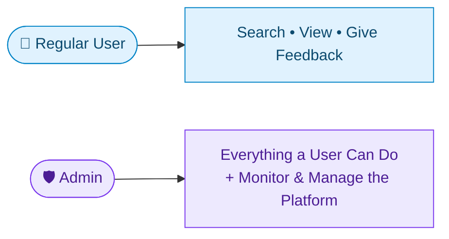

# 🛡️ Swasth Setu — Admin Interaction Guide

> A quick look at how an admin moves through Swasth Setu, from login to managing the platform.

---

## 🔄 Admin Flow

---

## 🧭 Step-by-Step

| Step | What the Admin Does | What Happens |
|---|---|---|
| 1️⃣ | Logs in with email & password | Identity verified via JWT |
| 2️⃣ | Role is checked on login | Only `admin` accounts reach the dashboard |
| 3️⃣ | Opens the Admin Dashboard | Centralized view of the platform |
| 4️⃣ | Monitors registered users | Visibility into who's using the platform |
| 5️⃣ | Reviews feedback & reviews | Can moderate or act on user submissions |
| 6️⃣ | Manages healthcare data | Keeps hospital-related data organized |
| 7️⃣ | Reviews platform activity | Overall oversight of what's happening |

---

## 🔑 Admin vs. Regular User Access

Admin access is gated by a **role check after login** — the same authentication flow as regular users, with an extra permission layer before reaching admin-only routes.