# ⚙️ Swasth Setu — Backend Architecture & Working

> A clear, diagram-driven explanation of how the Swasth Setu backend is structured and how requests flow through it — from authentication to hospital search, feedback, and admin management.

<p align="left">
  
  
  
</p>

> **Note:** Authentication is handled with a standard **email/password + JWT** flow. There is **no Google OAuth** in the current backend.

---

## 📋 Table of Contents

- [Backend Overview](#-backend-overview)
- [High-Level Architecture](#-high-level-architecture)
- [Backend Folder Structure](#-backend-folder-structure)
- [Request Lifecycle](#-request-lifecycle)
- [Authentication Flow (JWT)](#-authentication-flow-jwt)
- [Middleware Pipeline](#-middleware-pipeline)
- [Core Modules](#-core-modules)
  - [Hospital Search & Google Places Integration](#-hospital-search--google-places-integration)
  - [AI Recommendation Flow](#-ai-recommendation-flow)
  - [Feedback & Reviews](#-feedback--reviews)
  - [Admin Module](#-admin-module)
- [Data Models (Overview)](#-data-models-overview)
- [Error Handling](#-error-handling)
- [Security Practices](#-security-practices)

---

## 🧭 Backend Overview

The backend is a **Node.js + Express** application that exposes a REST API consumed by the React client. It is responsible for:

- Authenticating users with **email/password credentials and JWT sessions**
- Handling all business logic for hospital discovery, feedback, and reviews
- Talking to the **Google Places API** to fetch real-world hospital data
- Passing user requirements to the **AI recommendation layer**
- Persisting users, feedback, and reviews in **MongoDB**
- Providing protected admin-only endpoints for platform management

---

## 🏗️ High-Level Architecture

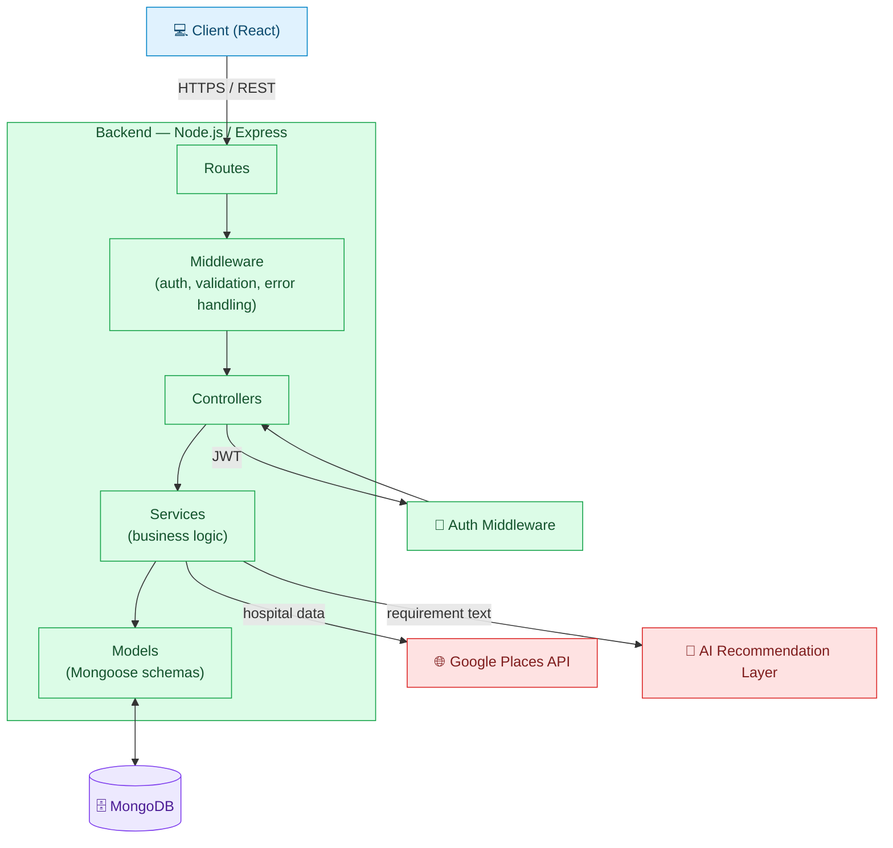

---

## 📁 Backend Folder Structure

```
server/
│
├── src/
│   ├── routes/          # Defines all API endpoints, grouped by feature
│   ├── controllers/     # Receives requests, calls services, sends responses
│   ├── services/        # Core business logic (hospital search, AI calls, feedback rules)
│   ├── models/          # Mongoose schemas (User, Feedback, Review, etc.)
│   ├── middleware/       # Auth (JWT), validation, error handling
│   ├── validators/      # Request payload validation rules
│   ├── utils/            # Helper functions (JWT signing, password hashing, formatting)
│   └── config/           # Environment config, DB connection, API keys
│
└── package.json
```

---

## 🔄 Request Lifecycle

Every API request — whether it's a search, a login, or a feedback submission — follows the same general path through the backend.

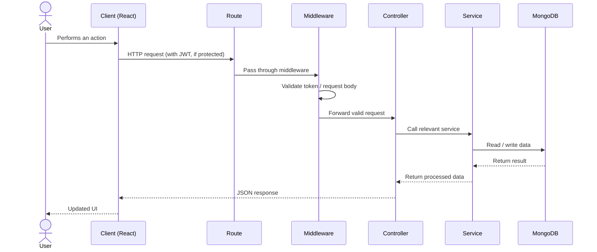

---

## 🔑 Authentication Flow (JWT)

Authentication uses a standard **email/password signup and login flow**, backed by hashed passwords and JWT-based sessions — there is no third-party OAuth provider involved.

### Signup

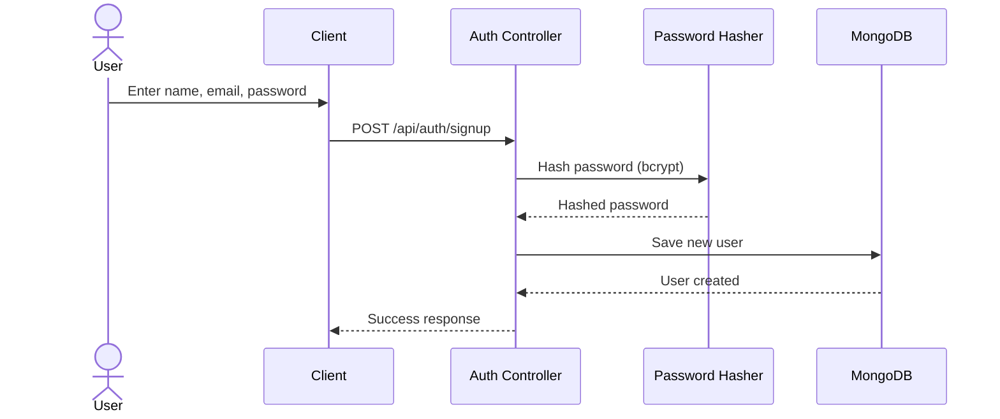

### Login

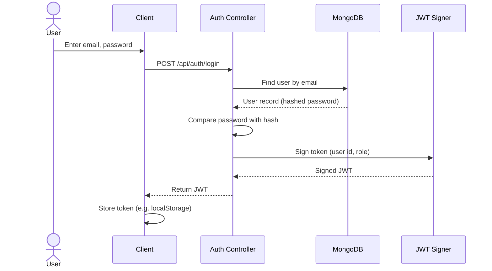

### Authenticated Request

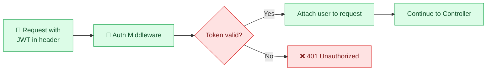

| Aspect | Detail |
|---|---|
| Credentials | Email + password |
| Password Storage | Hashed (never stored in plain text) |
| Session | Stateless — JWT sent with each request |
| Protected Routes | Verified via auth middleware before reaching controllers |

---

## 🧩 Middleware Pipeline

Every incoming request passes through a consistent middleware chain before reaching business logic, keeping validation, auth, and error handling centralized.

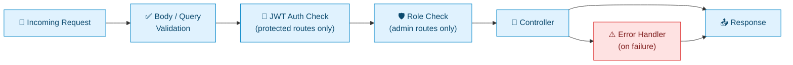

---

## 🧠 Core Modules

### 🏥 Hospital Search & Google Places Integration

All location-based search endpoints (nearby, state, district, name) follow the same pattern: the backend receives search parameters, forwards them to the Google Places API, and normalizes the response before sending it to the client.

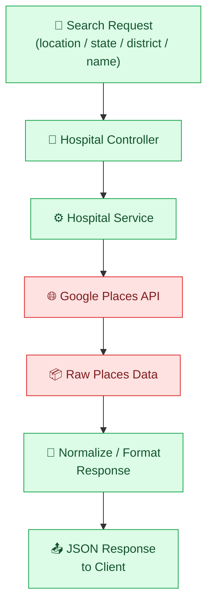

---

### 🤖 AI Recommendation Flow

The AI recommendation endpoint accepts a free-text requirement from the user, passes it to the AI layer along with available hospital context, and returns a ranked shortlist.

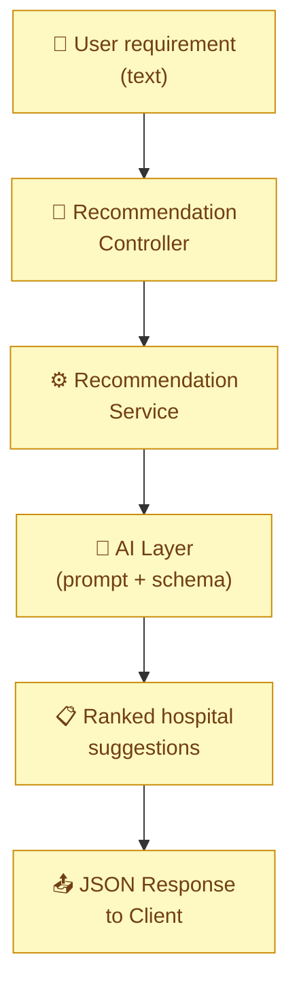

---

### ⭐ Feedback & Reviews

Feedback and review submissions are validated, tied to the authenticated user and the selected hospital (identified via its Google Places ID), and persisted to MongoDB.

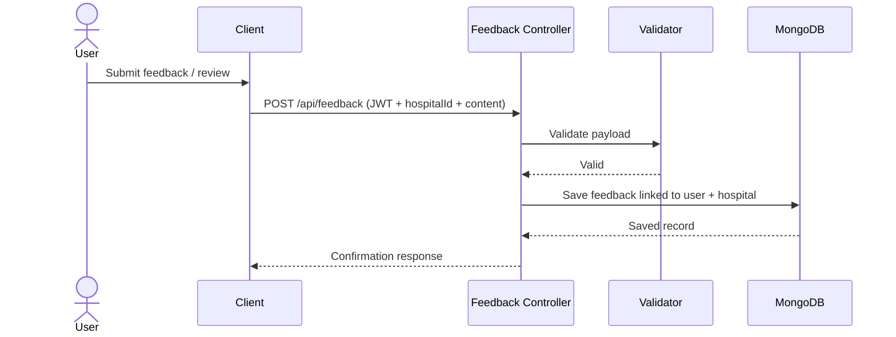

---

### 🛡️ Admin Module

Admin endpoints are protected by both authentication and a role check, ensuring only admin accounts can access user, feedback, and data-management operations.

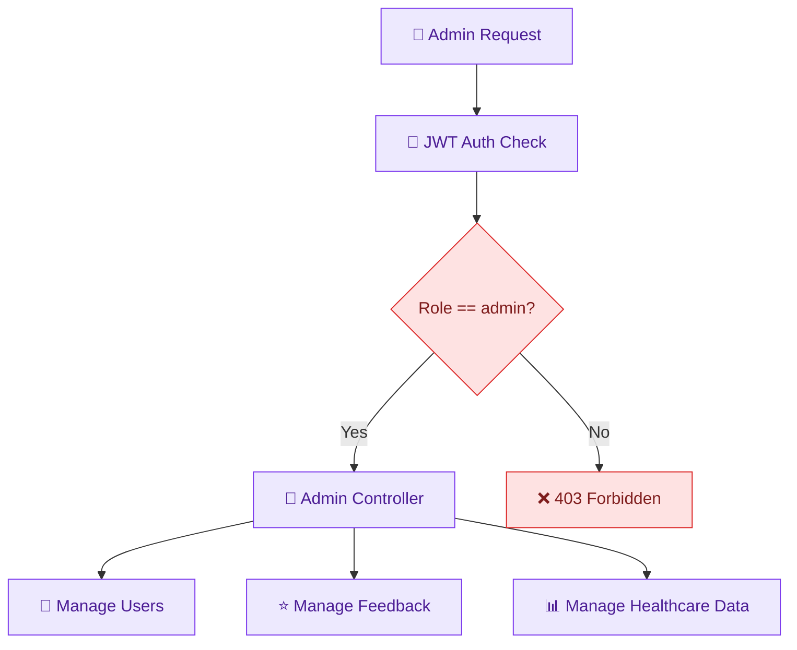

---

## 🗄️ Data Models (Overview)

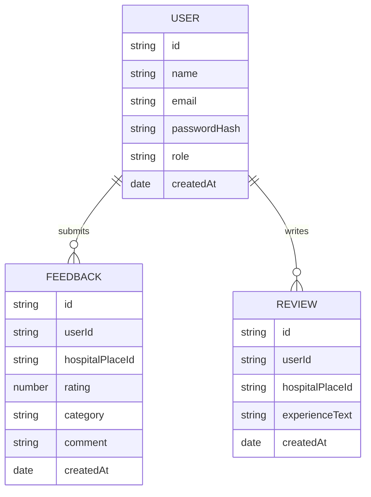

| Model | Purpose |
|---|---|
| **User** | Stores account details, hashed password, and role (user / admin) |
| **Feedback** | Structured feedback linked to a user and a Google Places hospital ID |
| **Review** | Free-text experience shared by a user for a specific hospital |

> Hospital records themselves are **not duplicated** in the database — hospital identity is referenced by its Google Places ID, and live details are fetched from the Google Places API on demand.

---

## ⚠️ Error Handling

All errors flow through a centralized error-handling middleware so that clients always receive a consistent response shape.

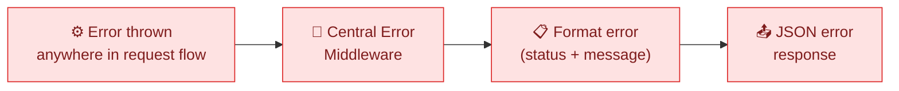

---

## 🔒 Security Practices

| Practice | Description |
|---|---|
| Password Hashing | Passwords hashed (bcrypt) before storage — never stored in plain text |
| JWT Sessions | Stateless tokens signed with a server-side secret |
| Route Protection | Auth middleware guards protected/admin routes |
| Role-Based Access | Admin routes additionally check user role before proceeding |
| Input Validation | Request payloads validated before reaching business logic |
| Centralized Errors | Errors handled consistently, avoiding leaked internals in responses |