# Swasth Setu: Feature Documentation

> **An AI-powered government healthcare platform that helps citizens discover hospitals, share feedback, report issues, and manage personal health records, while giving administrators the tools to monitor and improve healthcare services.**

This document describes every feature of Swasth Setu: what it does, who it is for, how it works, and how the pieces connect.

<p align="left">
  
  
  
</p>

---

## Table of Contents

- [Platform Overview](#platform-overview)
- [Features at a Glance](#features-at-a-glance)
- **Feature Details**
  - [Part A: Access and Identity](#part-a-access-and-identity)
  - [Part B: Hospital Discovery](#part-b-hospital-discovery)
  - [Part C: Citizen Engagement](#part-c-citizen-engagement)
  - [Part D: Personal Health Management](#part-d-personal-health-management)
  - [Part E: Administration and Monitoring](#part-e-administration-and-monitoring)
  - [Part F: Intelligence Layer](#part-f-intelligence-layer)
  - [Part G: Platform Experience](#part-g-platform-experience)
- [End-to-End Journeys](#end-to-end-journeys)
- [Backend Module Map](#backend-module-map)
- [Key Benefits](#key-benefits)

---

## Platform Overview

Swasth Setu brings together seven capability areas. Citizens use discovery, engagement, and personal health tools. Administrators use monitoring tools. The intelligence layer connects both sides by turning feedback and complaints into insights.

```mermaid
flowchart LR
    subgraph ACCESS["A. Access and Identity"]
        A2["Role-Based Access"]
    end

    subgraph DISCOVER["B. Hospital Discovery"]
        B1["AI Recommendation"]
        B2["Multi-Path Search"]
        B3["Interactive Map"]
        B4["Hospital Information"]
    end

    subgraph ENGAGE["C. Citizen Engagement"]
        C1["Feedback and Reviews"]
        C2["Complaint Reports"]
    end

    subgraph HEALTH["D. Personal Health"]
        D1["Health Profile"]
        D2["Medical Records"]
        D3["Secure Sharing"]
        D4["Emergency Card"]
        D5["Doctor Services"]
    end

    subgraph ADMIN["E. Administration"]
        E1["Admin Dashboard"]
        E2["Analytics"]
        E3["Issue Monitoring"]
        E4["Officers and Audit Logs"]
        E5["Reports and Export"]
    end

    subgraph INTEL["F. Intelligence"]
        F1["AI Insights"]
        F2["Performance Indicators"]
    end

    ACCESS --> DISCOVER
    ACCESS --> HEALTH
    DISCOVER --> ENGAGE
    ENGAGE --> INTEL
    INTEL --> ADMIN
    INTEL --> B3

    classDef access fill:#e0f2fe,stroke:#0284c7,color:#0c4a6e;
    classDef discover fill:#dcfce7,stroke:#16a34a,color:#14532d;
    classDef engage fill:#fef9c3,stroke:#ca8a04,color:#713f12;
    classDef health fill:#fce7f3,stroke:#db2777,color:#831843;
    classDef admin fill:#ede9fe,stroke:#7c3aed,color:#4c1d95;
    classDef intel fill:#fee2e2,stroke:#dc2626,color:#7f1d1d;

    class A1,A2 access;
    class B1,B2,B3,B4 discover;
    class C1,C2 engage;
    class D1,D2,D3,D4,D5 health;
    class E1,E2,E3,E4,E5 admin;
    class F1,F2 intel;
```

---

## Features at a Glance

| # | Feature | Summary | Audience |
|---|---|---|---|
| 1 | Authentication| standard login and registration | All users |
| 2 | Role-Based Access Control | Separate permissions for citizens and administrators | All users |
| 3 | User Account and Navigation | Personalized, authenticated experience with simple navigation | Citizens |
| 4 | AI Hospital Recommendation | AI-assisted hospital suggestions from a described need | Citizens |
| 5 | Nearby Hospital Search | Hospitals around the user's current location | Citizens |
| 6 | Search by State | Browse hospitals in a selected state | Citizens |
| 7 | Search by District | Narrow results to a specific district | Citizens |
| 8 | Search by Name | Direct lookup of a known hospital | Citizens |
| 9 | Pincode and Department Filters | Precise filtering by postal code and medical department | Citizens |
| 10 | Google Places API Integration | Real-world hospital data powering all search features | Platform |
| 11 | Interactive Hospital Map | Leaflet map with markers, clustering, filters, and status colors | Citizens, Admins |
| 12 | Hospital Information | One consolidated detail view per hospital | Citizens |
| 13 | Hospital Feedback and Reviews | Ratings, issue categories, and visit details | Citizens |
| 14 | Government Complaint Reports | Submit and track healthcare complaints | Citizens |
| 15 | Personal Health Profile | Vitals, conditions, allergies, medications, and history | Citizens |
| 16 | Medical Records and Timeline | Documents, prescriptions, reports, and health timeline | Citizens |
| 17 | Secure Sharing | Controlled sharing of health data with doctors and hospitals | Citizens |
| 18 | Emergency Health Card | Critical medical information available at a glance | Citizens |
| 19 | Doctor Services | Doctor profiles, specialties, and consultation workflow | Citizens |
| 20 | Admin Dashboard | Central control room for healthcare monitoring | Admins |
| 21 | Analytics | Trends, severity, categories, and resolution rates | Admins |
| 22 | Issue Monitoring and Escalation | Critical and repeated issues surfaced automatically | Admins |
| 23 | Officer Management | Assign complaints and track officer workload | Admins |
| 24 | Audit Logs | Traceable record of administrative actions | Admins |
| 25 | Reports and Export | Export complaint and hospital data | Admins |
| 26 | AI Insights and Performance Indicators | Trend detection and Good, Monitoring, Poor hospital status | Admins, Citizens |
| 27 | Responsive Design | Consistent experience across desktop, tablet, and mobile | All users |

---

# Feature Details

Every feature below follows the same layout: a short overview, what users can do, a flow diagram, and a details table.

---

## Part A: Access and Identity

### 1. Authentication and Google OAuth

> Secure, low-friction access using a standard login and registration.

**Overview**
Users can sign in instantly with standard login and registration. After sign-in, a signed token identifies the user on every protected request.

**Capabilities**
- Use standard login and registration as an alternative
- Stay signed in through a secure, token-based session
- Access protected, user-specific areas after login

**Flow**

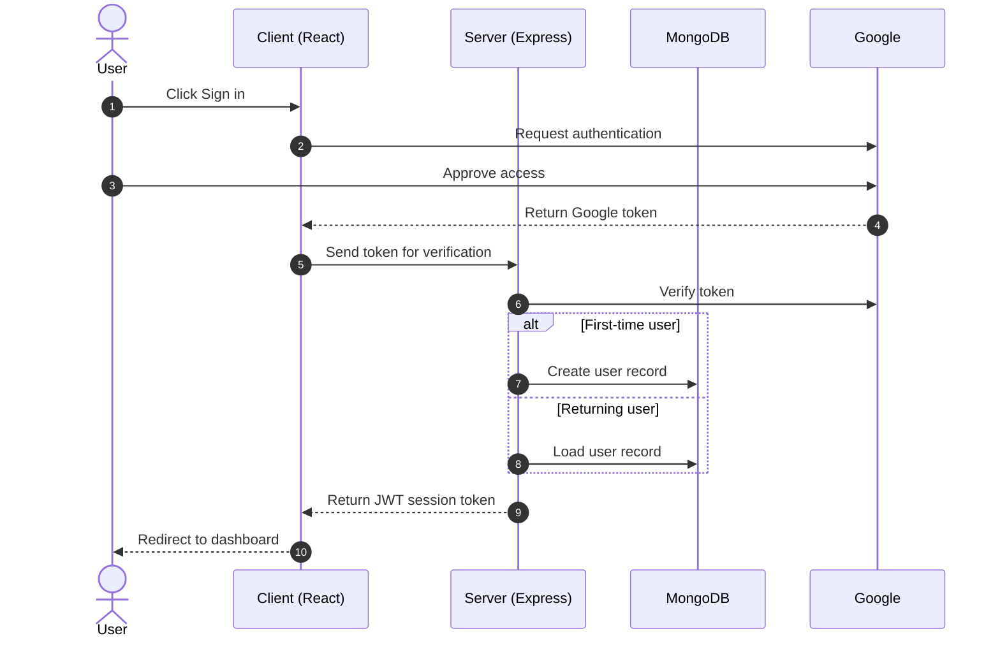

**Details**

| Aspect | Detail |
|---|---|
| Methods | standard login and registration |
| Session | JWT-based, sent with each protected request |
| Outcome | Unlocks user-specific and role-specific features |

---

### 2. Role-Based Access Control

> Every request is checked for identity and role before it reaches protected features.

**Overview**
The platform separates citizen features from administrative features. Authentication middleware confirms who the user is, and admin middleware confirms they are allowed to use administrative tools.

**Capabilities**
- Citizens access discovery, feedback, complaints, and personal health tools
- Administrators access the dashboard, analytics, officer tools, and exports
- Unauthenticated visitors cannot reach protected routes

**Flow**

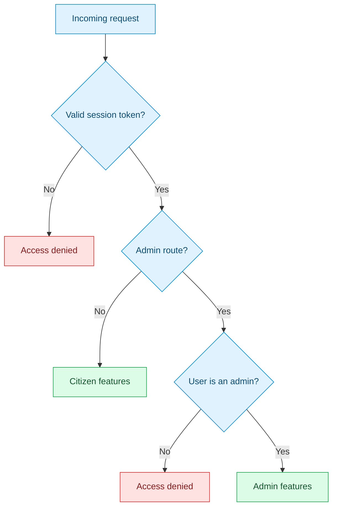

**Details**

| Aspect | Detail |
|---|---|
| Roles | Citizen, Administrator |
| Enforcement | Authentication middleware, then admin middleware for admin routes |
| Purpose | Protects sensitive health data and administrative tools |

---

### 3. User Account and Navigation

> A personalized, authenticated experience organized around clear healthcare categories.

**Overview**
Once signed in, every feature responds to who the user is. Navigation is grouped into simple healthcare categories so users can move between discovery, feedback, complaints, and health management without friction.

**Capabilities**
- Access a personal account and profile after login
- Navigate by clear categories: find hospitals, report an issue, manage health, use doctor services
- Use search-based interaction across the platform as an authenticated user

**Flow**

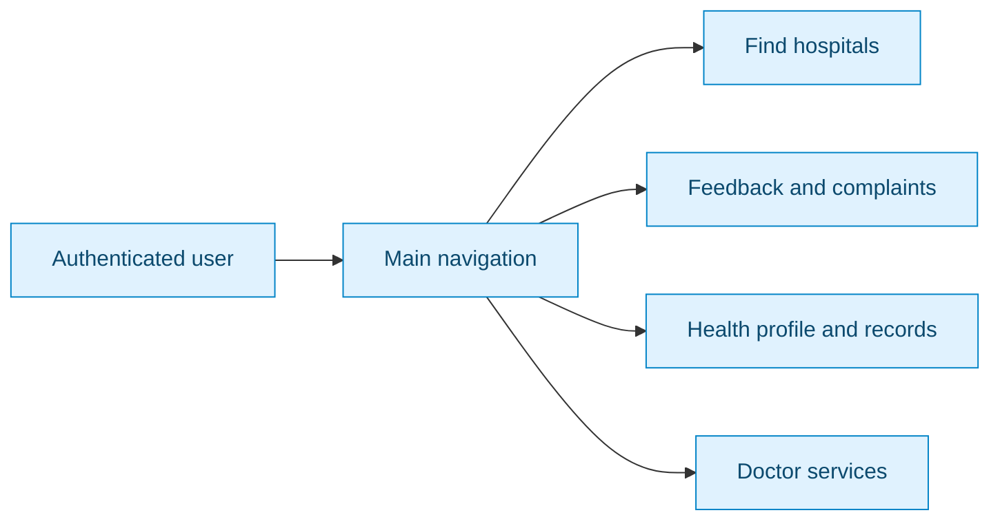

**Details**

| Aspect | Detail |
|---|---|
| Requires | Successful authentication |
| Enables | Personal profile, personalized navigation, feature interaction |

---

## Part B: Hospital Discovery

Citizens can reach a hospital through five discovery paths. All of them converge on the same hospital information view.

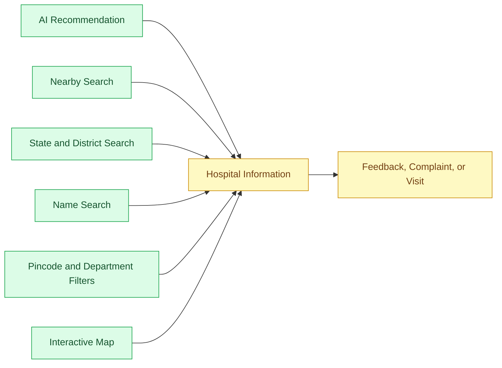

### 4. AI Hospital Recommendation

> Describe what you need in plain language and receive a shortlist of suitable hospitals.

**Overview**
For users who do not know where to go, the platform accepts a described healthcare requirement and uses AI assistance to suggest suitable hospitals. This turns an open-ended question into a short, relevant list.

**Capabilities**
- Describe a healthcare need in natural language
- Receive AI-assisted hospital suggestions tailored to that need
- Review the shortlist and open any hospital's detail view

**Flow**

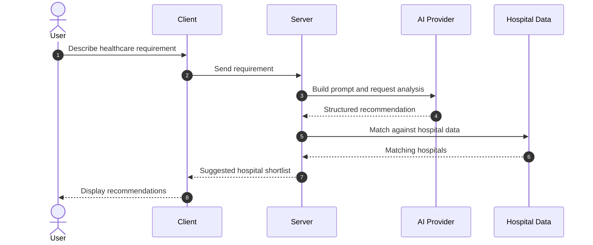

**Details**

| Aspect | Detail |
|---|---|
| Input | User-described healthcare requirement |
| Output | AI-suggested hospital shortlist |
| Purpose | Simplifies decision-making for patients and families |

---

### 5. Nearby Hospital Search

> Discover hospitals around your current location without typing a query.

**Overview**
Using the device location, the platform asks Google Places for hospitals close to the user and displays them with available details.

**Capabilities**
- View hospitals near the current location
- See available details for each nearby facility
- Explore options without entering any search text

**Flow**

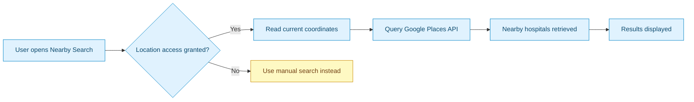

**Details**

| Aspect | Detail |
|---|---|
| Data source | Google Places API |
| Trigger | User's current location |
| Result | List of nearby facilities with available details |

---

### 6. Search by State

> Browse hospitals within any state, useful when looking beyond your immediate area.

**Overview**
Users pick a state and the platform retrieves hospitals located there. This is the first level of the location drill-down and can be refined by district.

**Capabilities**
- Select a state to view hospitals in that region
- Browse facilities outside the current location
- Continue to a district for more targeted results

**Flow**

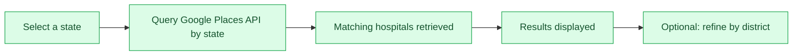

**Details**

| Aspect | Detail |
|---|---|
| Filter level | State |
| Data source | Google Places API |
| Use case | Searching outside the user's current area |

---

### 7. Search by District

> Narrow a state-level search to a district for more locally relevant results.

**Overview**
After choosing a state, users can select a district to see hospitals in that smaller area, which gives more targeted results than a state-wide search.

**Capabilities**
- Select a district within a chosen state
- Get more targeted results than a state-wide search
- Combine with department or pincode filters

**Flow**

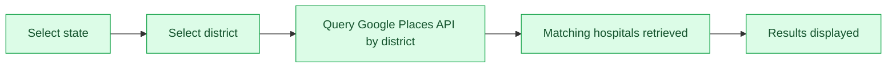

**Details**

| Aspect | Detail |
|---|---|
| Filter level | District (within a state) |
| Data source | Google Places API |
| Use case | Refining a state-level search |

---

### 8. Search by Name

> Jump straight to a specific hospital when you already know its name.

**Overview**
Users who know which hospital they want can type its name and get matching results immediately, then open the full details.

**Capabilities**
- Search for a specific, known hospital
- See matching results as soon as the query runs
- Open the hospital's details directly

**Flow**

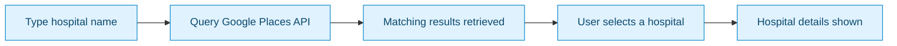

**Details**

| Aspect | Detail |
|---|---|
| Input | Hospital name (free text) |
| Data source | Google Places API |
| Use case | Quick lookup of a known facility |

---

### 9. Pincode and Department Filters

> Combine location and medical specialty filters to find exactly the right facility.

**Overview**
Beyond state and district, users can filter by postal code and by department (for example, cardiology). Filters can be combined to narrow the results to hospitals that match both the place and the specialty.

**Capabilities**
- Filter hospitals by pincode
- Filter hospitals by medical department
- Combine with state, district, or name search

**Flow**

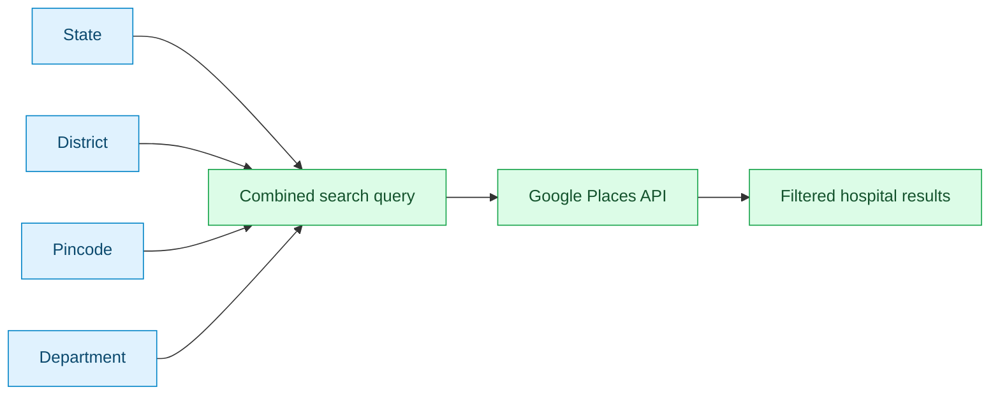

**Details**

| Aspect | Detail |
|---|---|
| Filters | State, district, pincode, department |
| Data source | Google Places API |
| Use case | Precise, needs-based hospital discovery |

---

### 10. Google Places API Integration

> The real-world data source behind every search, detail view, and feedback flow.

**Overview**
Rather than relying on a manually maintained hospital list, the platform uses Google Places for current, real-world data. The same integration serves discovery, hospital details, and hospital selection during feedback.

**Capabilities**
- Powers nearby, state, district, name, pincode, and department searches
- Supplies hospital name, location, contact information, ratings, and operating status
- Lets users select the exact hospital when submitting feedback

**Flow**

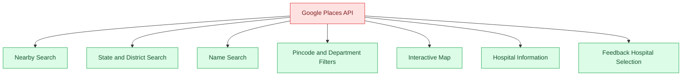

**Details**

| Aspect | Detail |
|---|---|
| Provides | Name, location, contact info, ratings, operating status, map data |
| Used by | All search features, the map, hospital details, and feedback |
| Benefit | Current real-world data instead of static lists |

---

### 11. Interactive Hospital Map

> Explore hospitals visually, with performance status shown directly on the map.

**Overview**
The map is built with Leaflet and OpenStreetMap. Every hospital appears as a marker, colored by its performance status. Users can search, filter, and open a hospital directly from its marker.

**Capabilities**
- View hospital markers on an interactive map
- See performance indicators at a glance through marker colors
- Zoom into dense areas thanks to marker clustering
- Search and filter hospitals directly on the map
- Open hospital details from a marker

**Flow**

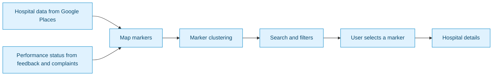

**Status indicators**

| Indicator | Meaning |
|---|---|
| 🟢 Good | Hospital is performing well based on feedback and complaints |
| 🟡 Monitoring | Some concerns detected, being watched |
| 🔴 Poor | Significant issues, requires attention |

**Details**

| Aspect | Detail |
|---|---|
| Technology | Leaflet, OpenStreetMap |
| Interaction | Markers, clustering, search, filters |
| Data | Hospital locations plus platform performance status |

---

### 12. Hospital Information

> Everything known about a hospital, consolidated in one view.

**Overview**
The hospital information view is where every discovery path ends. It combines real-world data from Google Places with what the platform knows from user feedback and complaint reports.

**Capabilities**
- View hospital name, address, and location
- See contact details, ratings, and operating status
- Read feedback and reports associated with the hospital
- Start a feedback submission or complaint from the same screen

**Flow**

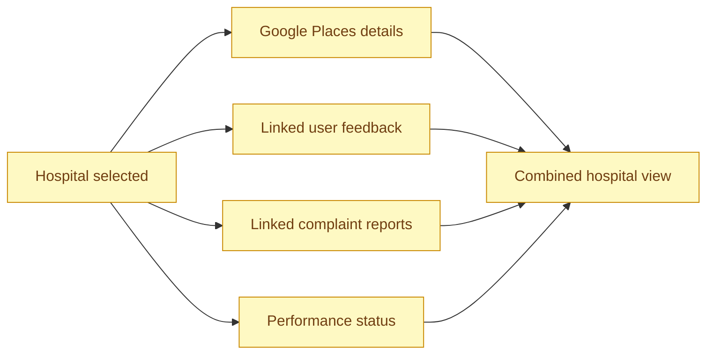

**Details**

| Aspect | Detail |
|---|---|
| Combines | Google Places details, user feedback, platform reports |
| Shows | Name, address, contact, ratings, operating status, map location |
| Access point | Reachable from every search path and the map |

---

## Part C: Citizen Engagement

### 13. Hospital Feedback and Reviews

> Structured feedback tied to the exact hospital a citizen visited.

**Overview**
Citizens can review a hospital they have visited. The hospital is selected through Google Places results so feedback always links to the correct facility, and the feedback contributes to the hospital's public record and performance status.

**Capabilities**
- Search for and select the exact hospital
- Give a rating and choose issue categories
- Add visit information
- View personal feedback history

**Flow**

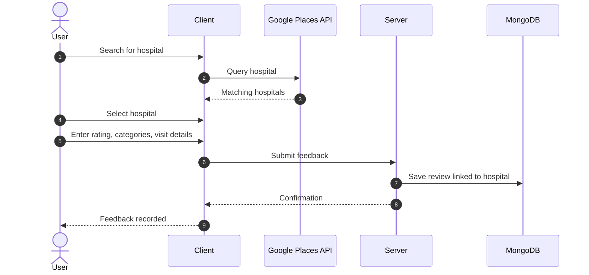

**Details**

| Aspect | Detail |
|---|---|
| Hospital selection | Through Google Places search results |
| Captured data | Rating, issue categories, visit information |
| Storage | Linked to the specific facility |
| Impact | Feeds hospital performance analysis |

---

### 14. Government Complaint Reports

> A transparent channel for citizens to report healthcare problems and follow resolution.

**Overview**
Citizens can submit formal complaints about a hospital, including the nature and severity of the issue. Each complaint can be tracked through resolution, and citizens can view their report history.

**Capabilities**
- Submit a complaint against a hospital
- Specify the issue type and severity
- Receive a tracking reference
- Track status and view report history

**Lifecycle**

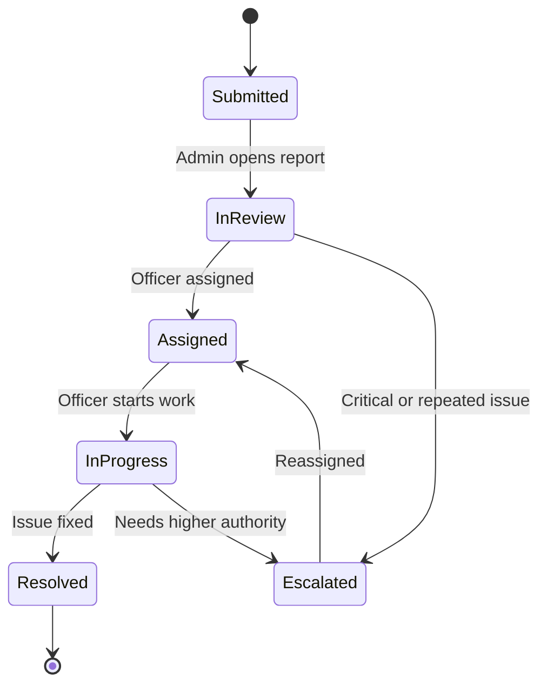

**Submission flow**

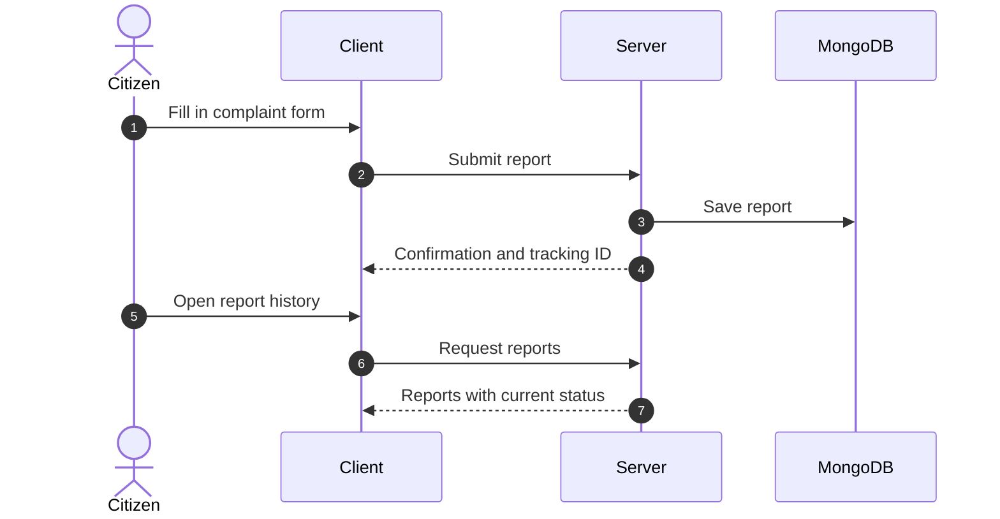

**Details**

| Aspect | Detail |
|---|---|
| Captured data | Hospital, issue, severity, description |
| Tracking | Status updates through resolution |
| Consumers | Admin dashboard, analytics, AI insights |

---

## Part D: Personal Health Management

### 15. Personal Health Profile

> One editable profile holding a citizen's essential health information.

**Overview**
The health profile stores personal and medical details in a structured form. A completeness tracker shows how much of the profile is filled in and encourages users to keep it current.

**Capabilities**
- Store personal information and vitals (blood group, height, weight, blood pressure)
- Record conditions, allergies, medications, and medical history
- Add lifestyle and emergency information
- Edit the profile at any time
- Track profile completeness
- Download or print the profile

**Structure**

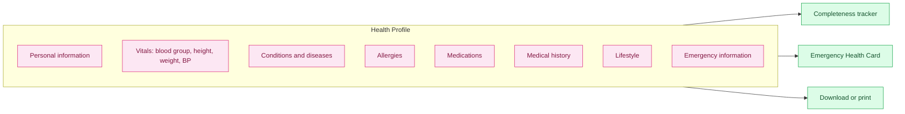

**Details**

| Aspect | Detail |
|---|---|
| Access | Authenticated citizen only |
| Editable | Yes, at any time |
| Feeds | Emergency Health Card, secure sharing |

---

### 16. Medical Records and Timeline

> All medical documents and events organized in one personal record.

**Overview**
Citizens can keep their medical documents, prescriptions, and reports in one place. A health timeline arranges these records chronologically so the full medical story is easy to follow.

**Capabilities**
- Store medical documents, prescriptions, and reports
- View records on a health timeline
- Keep personal medical records organized
- Download or print records

**Flow**

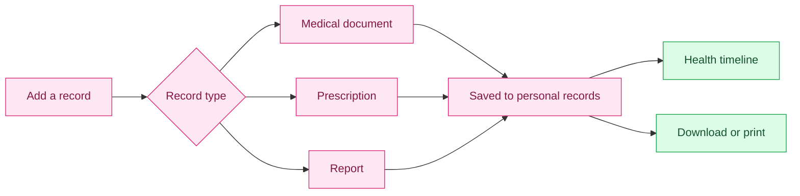

**Details**

| Aspect | Detail |
|---|---|
| Record types | Documents, prescriptions, reports |
| View | Chronological health timeline |
| Access | Private to the owner unless shared |

---

### 17. Secure Sharing

> Share only what is needed with the doctors and hospitals that need it.

**Overview**
Citizens can share selected health information with a doctor or hospital. Sharing is controlled, so the recipient sees only the information that was chosen, not the whole record.

**Capabilities**
- Choose which health information to share
- Choose who receives it: a doctor or a hospital
- Keep access limited to the shared information

**Flow**

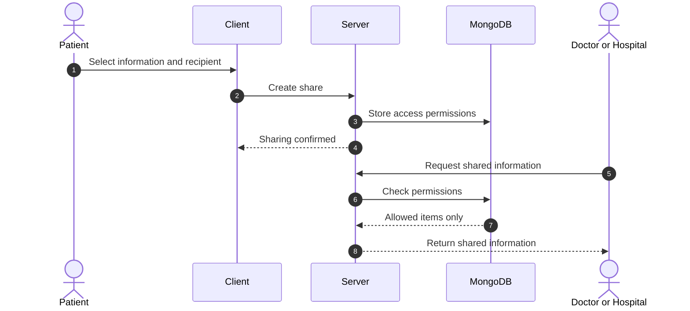

**Details**

| Aspect | Detail |
|---|---|
| Control | Patient decides what and with whom |
| Recipients | Doctors, hospitals |
| Principle | Least access: only shared items are visible |

---

### 18. Emergency Health Card

> Critical medical facts, available in seconds when they matter most.

**Overview**
The emergency card surfaces the most important information for urgent situations. It is built from the health profile, so it stays current as the profile is updated.

**Card contents**

| Field | Why it matters |
|---|---|
| Blood group | Needed for transfusions and urgent treatment |
| Allergies | Prevents dangerous reactions |
| Medical conditions | Guides emergency care decisions |
| Emergency contact | Lets responders reach a trusted person |

**Flow**

```mermaid
flowchart LR
    P["Health Profile"] --> C["Emergency Health Card"]
    C --> Q["Quick access in urgent situations"]

    classDef step fill:#fee2e2,stroke:#dc2626,color:#7f1d1d;
    class P,C,Q step;
```

**Details**

| Aspect | Detail |
|---|---|
| Source | Personal health profile |
| Access | Quick access to essential information only |
| Purpose | Faster, safer emergency response |

---

### 19. Doctor Services

> Doctor profiles, specialties, and a consultation workflow in one place.

**Overview**
Citizens can find doctors by specialty, view their profiles, and follow a consultation and appointment workflow.

**Capabilities**
- Browse doctor profiles and specialties
- Follow a consultation workflow
- Use appointment-related functionality

**Flow**

```mermaid
flowchart LR
    A["Browse doctors"] --> B["View profile and specialty"]
    B --> C["Start consultation workflow"]
    C --> D["Appointment"]
    D --> E["Optional: share health records securely"]

    classDef step fill:#fce7f3,stroke:#db2777,color:#831843;
    class A,B,C,D,E step;
```

**Details**

| Aspect | Detail |
|---|---|
| Content | Doctor profiles, specialties |
| Workflow | Consultation and appointments |
| Integration | Works with Secure Sharing |

---

## Part E: Administration and Monitoring

### 20. Admin Dashboard

> A single control room for monitoring healthcare services.

**Overview**
The admin dashboard is the entry point for government administrators. It brings together hospital performance, complaints, analytics, and notifications, and provides tools for hospital comparison and administrative management.

**Capabilities**
- Monitor hospitals and their performance status
- Review and manage complaints
- Compare hospitals against each other
- Receive notifications about important events
- Manage users, feedback, and healthcare data

**Flow**

```mermaid
flowchart TD
    A(["Administrator"]) --> D["Admin Dashboard"]
    D --> M1["Hospital monitoring"]
    D --> M2["Complaint management"]
    D --> M3["Hospital comparison"]
    D --> M4["Analytics"]
    D --> M5["Notifications"]
    D --> M6["Officers, audit logs, exports"]

    classDef admin fill:#ede9fe,stroke:#7c3aed,color:#4c1d95;
    class A,D,M1,M2,M3,M4,M5,M6 admin;
```

**Details**

| Aspect | Detail |
|---|---|
| Access | Restricted to administrators |
| Manages | Hospitals, complaints, feedback, users, healthcare data |
| Purpose | Centralized oversight of healthcare services |

---

### 21. Analytics

> Turn complaints and feedback into clear, actionable numbers.

**Overview**
Analytics summarize what is happening across hospitals and regions so administrators can prioritize their attention.

**Metrics**

| Metric | What it shows |
|---|---|
| Complaint trends | How complaint volume changes over time |
| Severity | How serious reported issues are |
| Categories | Which types of problems occur most |
| Resolution rates | How effectively complaints are closed |
| Hospital performance | How hospitals compare on quality |
| District-level analysis | Which districts have the most issues |

**Flow**

```mermaid
flowchart LR
    C["Complaint reports"] --> AN["Analytics engine"]
    F["Hospital feedback"] --> AN
    H["Hospital data"] --> AN
    AN --> M1["Trends"]
    AN --> M2["Severity and categories"]
    AN --> M3["Resolution rates"]
    AN --> M4["Hospital and district views"]

    classDef src fill:#e0f2fe,stroke:#0284c7,color:#0c4a6e;
    classDef proc fill:#ede9fe,stroke:#7c3aed,color:#4c1d95;
    class C,F,H src;
    class AN,M1,M2,M3,M4 proc;
```

---

### 22. Issue Monitoring and Escalation

> Critical and recurring problems are surfaced so they are not missed.

**Overview**
The platform highlights critical issues and repeated complaints and flags hospitals that need attention. Administrators can escalate these issues to higher authority.

**Capabilities**
- Detect critical-severity complaints
- Detect repeated complaints about the same hospital or issue
- List hospitals requiring attention
- Escalate issues for faster resolution

**Flow**

```mermaid
flowchart TD
    N["New complaint"] --> S{"Critical severity?"}
    S -->|"Yes"| FLAG["Flag as critical"]
    S -->|"No"| R{"Repeated issue at this hospital?"}
    R -->|"Yes"| FLAG2["Flag as repeated"]
    R -->|"No"| NORM["Normal queue"]
    FLAG --> LIST["Attention-required hospitals"]
    FLAG2 --> LIST
    LIST --> ESC["Admin escalates"]

    classDef bad fill:#fee2e2,stroke:#dc2626,color:#7f1d1d;
    classDef step fill:#ede9fe,stroke:#7c3aed,color:#4c1d95;
    classDef ok fill:#dcfce7,stroke:#16a34a,color:#14532d;
    class FLAG,FLAG2,LIST bad;
    class N,S,R,ESC step;
    class NORM ok;
```

---

### 23. Officer Management

> Assign complaints to officers and keep track of who is working on what.

**Overview**
Administrators can assign complaints to specific officers and monitor each officer's workload and progress, which keeps accountability clear.

**Capabilities**
- Assign complaints to officers
- Track officer workload
- Follow progress on assigned complaints

**Flow**

```mermaid
sequenceDiagram
    autonumber
    actor Admin
    participant Dash as Admin Dashboard
    participant Server as Server
    participant DB as MongoDB
    actor Officer

    Admin->>Dash: Select complaint and officer
    Dash->>Server: Assign complaint
    Server->>DB: Update assignment
    Server->>DB: Write audit log entry
    Officer->>Server: Update progress
    Server->>DB: Save status change
    Admin->>Dash: View workload and progress
```

**Details**

| Aspect | Detail |
|---|---|
| Actions | Assign, reassign, track |
| Visibility | Workload and progress per officer |
| Traceability | Assignments recorded in audit logs |

---

### 24. Audit Logs

> A permanent, reviewable trail of administrative actions.

**Overview**
Administrative actions and changes are recorded so that decisions can be reviewed later. This supports accountability and transparency in a government setting.

**Flow**

```mermaid
flowchart LR
    A["Admin action"] --> B["Server applies change"]
    B --> C["Audit log entry written"]
    C --> D["Reviewable in audit log view"]

    classDef step fill:#ede9fe,stroke:#7c3aed,color:#4c1d95;
    class A,B,C,D step;
```

**Details**

| Aspect | Detail |
|---|---|
| Records | Administrative actions and changes |
| Purpose | Accountability, review, and transparency |
| Access | Administrators only |

---

### 25. Reports and Export

> Take complaint and hospital data out of the platform for reporting and analysis.

**Overview**
Administrators can export complaint and hospital data to support offline analysis, formal reporting, and record keeping.

**Flow**

```mermaid
flowchart LR
    A["Choose data: complaints or hospitals"] --> B["Apply filters"]
    B --> C["Generate export"]
    C --> D["Download file"]

    classDef step fill:#ede9fe,stroke:#7c3aed,color:#4c1d95;
    class A,B,C,D step;
```

**Details**

| Aspect | Detail |
|---|---|
| Data | Complaint data, hospital data |
| Use cases | Formal reporting, offline analysis, record keeping |

---

## Part F: Intelligence Layer

### 26. AI Insights and Performance Indicators

> Data-based insights that reveal problem areas and drive the hospital status indicators.

**Overview**
The AI layer analyzes feedback and complaints to detect trends and repeated issues, and to identify hospitals that need attention. The same analysis produces the Good, Monitoring, or Poor status shown on the map and dashboard.

**Capabilities**
- Detect complaint trends over time
- Identify repeated issues and healthcare problem areas
- Highlight hospitals that require attention
- Assign performance status to each hospital

**Insight generation**

```mermaid
sequenceDiagram
    autonumber
    actor Admin
    participant Client as Client
    participant Server as Server
    participant DB as MongoDB
    participant AI as AI Provider

    Admin->>Client: Open dashboard
    Client->>Server: Request insights
    Server->>DB: Fetch complaints and feedback
    DB-->>Server: Data
    Server->>AI: Analyze trends and repeated issues
    AI-->>Server: Insights and severity tags
    Server-->>Client: Insights and flagged hospitals
    Client-->>Admin: Display insights
```

**Performance indicator pipeline**

```mermaid
flowchart LR
    A["Hospital feedback"] --> C["AI trend analysis"]
    B["Complaint reports"] --> C
    C --> D{{"Performance score"}}
    D -->|"High"| E["🟢 Good"]
    D -->|"Medium"| F["🟡 Monitoring"]
    D -->|"Low"| G["🔴 Poor"]
    E --> H["Hospital map"]
    F --> H
    G --> H
    E --> I["Admin dashboard"]
    F --> I
    G --> I

    classDef good fill:#dcfce7,stroke:#16a34a,color:#14532d;
    classDef warn fill:#fef9c3,stroke:#ca8a04,color:#713f12;
    classDef bad fill:#fee2e2,stroke:#dc2626,color:#7f1d1d;
    class E good;
    class F warn;
    class G bad;
```

**Details**

| Aspect | Detail |
|---|---|
| Inputs | Complaint reports, hospital feedback |
| Outputs | Insights, severity tags, performance status |
| Shown on | Admin dashboard, interactive map, hospital details |

---

## Part G: Platform Experience

### 27. Responsive Design

> One consistent experience across every screen size.

**Overview**
The interface adapts to desktop, laptop, tablet, and mobile, so users are not tied to a single device. This matters especially for citizens who may only have a phone.

**Flow**

```mermaid
flowchart LR
    A["Desktop and laptop"] --> E["Responsive layout"]
    B["Tablet"] --> E
    C["Mobile"] --> E
    E --> F["Consistent user experience"]

    classDef step fill:#dcfce7,stroke:#16a34a,color:#14532d;
    class A,B,C,E,F step;
```

**Details**

| Aspect | Detail |
|---|---|
| Devices | Desktop, laptop, tablet, mobile |
| Outcome | Consistent, accessible experience on every screen |

---

## End-to-End Journeys

### Citizen Journey

```mermaid
flowchart TD
    U(["Citizen"]) --> LOGIN["Sign in with Google"]
    LOGIN --> DASH["Healthcare dashboard"]

    DASH --> AI["AI recommendation"]
    DASH --> NEAR["Nearby hospitals"]
    DASH --> SEARCH["Search by state, district, name, pincode, department"]
    DASH --> MAP["Interactive map"]

    AI --> INFO["Hospital information"]
    NEAR --> INFO
    SEARCH --> INFO
    MAP --> INFO

    INFO --> FB["Give feedback"]
    INFO --> RPT["Report an issue"]
    DASH --> HEALTH["Manage health profile and records"]
    HEALTH --> SHARE["Share securely with doctors"]
    HEALTH --> CARD["Emergency Health Card"]
    DASH --> DOC["Doctor services"]

    classDef user fill:#e0f2fe,stroke:#0284c7,color:#0c4a6e;
    classDef feat fill:#dcfce7,stroke:#16a34a,color:#14532d;
    classDef health fill:#fce7f3,stroke:#db2777,color:#831843;
    class U,LOGIN,DASH user;
    class AI,NEAR,SEARCH,MAP,INFO,FB,RPT feat;
    class HEALTH,SHARE,CARD,DOC health;
```

### Administrator Journey

```mermaid
flowchart TD
    A(["Administrator"]) --> DASH["Admin dashboard"]
    DASH --> MON["Monitor hospitals"]
    MON --> REV["Review complaints"]
    REV --> ANA["Analyze performance and AI insights"]
    ANA --> ASG["Assign officers"]
    ASG --> RES["Resolve or escalate"]
    RES --> EXP["Generate reports and export"]
    DASH -.-> AUD["Audit logs record every action"]

    classDef admin fill:#ede9fe,stroke:#7c3aed,color:#4c1d95;
    class A,DASH,MON,REV,ANA,ASG,RES,EXP,AUD admin;
```

---

## Backend Module Map

| Feature area | Primary backend module |
|---|---|
| Authentication and access control | `authController`, `authMiddleware`, `adminMiddleware` |
| Hospital discovery and information | `hospitalController` |
| Feedback and reviews | `reviewController`, `Review` model |
| Complaint reports | `reportController`, `Report` and `HospitalReport` models |
| Health profile and emergency card | `profileController`, `HealthProfile` model |
| Medical records and sharing | `recordController`, `MedicalRecord` model |
| Administration, analytics, officers, export | `adminController` |
| Audit logs | `AuditLog` model |
| AI insights and recommendations | `aiController` |

---

## Key Benefits

**For Citizens and Families**
- Faster hospital discovery through multiple search paths and AI-assisted recommendations
- Clear, consolidated hospital information with real-world data
- A transparent way to give feedback and report problems
- One secure place for health profile, records, and emergency information
- Controlled sharing with doctors and hospitals

**For Government Administrators**
- A single dashboard to monitor hospitals, complaints, and trends
- Early warning on critical and repeated issues
- Clear officer assignment and workload tracking
- Full accountability through audit logs
- Exportable data for reporting and policy decisions

**For the Healthcare System**
- Evidence-based insight into where services need improvement
- A feedback loop between citizens and administration that makes healthcare more transparent and accessible

---

<p align="center"><b>Swasth Setu</b>: bridging citizens, hospitals, and government health administration.</p>