# Swasth Setu: Frontend Guide

> **How the Swasth Setu client works: architecture, routing, state, API communication, and every feature screen, explained with diagrams.**

The frontend is a single-page application built with **React** and **Vite**. It gives citizens tools to discover hospitals, share feedback, report issues, and manage personal health records, and it gives administrators a dashboard to monitor healthcare services.

<p align="left">
  
  
  
  
</p>

---

## Table of Contents

- [1. Overview](#1-overview)
- [2. Tech Stack](#2-tech-stack)
- [3. Getting Started](#3-getting-started)
- [4. Folder Structure](#4-folder-structure)
- [5. Application Architecture](#5-application-architecture)
- [6. App Startup and Routing](#6-app-startup-and-routing)
- [7. Layouts](#7-layouts)
- [8. State Management](#8-state-management)
- [9. API Communication](#9-api-communication)
- [10. Feature Screens](#10-feature-screens)
- [11. Reusable UI Building Blocks](#11-reusable-ui-building-blocks)
- [12. Loading, Empty, and Error States](#12-loading-empty-and-error-states)
- [13. Responsive Design](#13-responsive-design)
- [14. Frontend Security Notes](#14-frontend-security-notes)
- [15. Adding a New Feature](#15-adding-a-new-feature)
- [16. Troubleshooting](#16-troubleshooting)

---

## 1. Overview

The client has one job: turn user actions into API calls and API responses into screens. It never talks to the database directly and it never enforces security on its own. The backend does that. The frontend only makes the experience smooth.

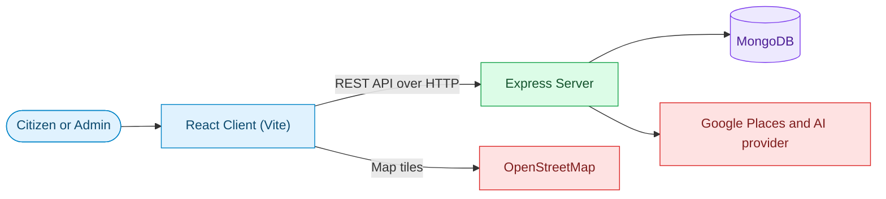

**Key ideas**

- The client talks only to the Swasth Setu backend. Google Places and AI requests are made by the server, and the client receives the results through the API.
- The one direct third-party connection is OpenStreetMap, which supplies map tiles to Leaflet.
- Two kinds of users see two different parts of the app: citizens and administrators.

---

## 2. Tech Stack

| Concern | Technology |
|---|---|
| UI library | React |
| Build tool and dev server | Vite |
| Global state | Context API |
| Reusable logic | Custom hooks |
| Maps | Leaflet with OpenStreetMap tiles |
| Device location | Browser Geolocation API |
| Server communication | REST API through a service layer |
| Authentication | JWT sent with each protected request |

---

## 3. Getting Started

### Prerequisites

- Node.js v18 or later
- npm or yarn
- The backend running locally (see the root README)

### Setup

```bash
cd client
npm install
```

### Environment

Create `client/.env`:

```env
VITE_API_BASE_URL=http://localhost:5000/api
```

> Variables starting with `VITE_` are bundled into the browser build and are visible to anyone. Never put secrets in them.

### Run

```bash
npm run dev
```

The app runs at `http://localhost:5173` and calls the backend at the URL set in `VITE_API_BASE_URL`.

---

## 4. Folder Structure

```
client/
│
├── index.html            # Single HTML page that hosts the React app
├── package.json          # Dependencies and scripts
├── package-lock.json
├── vite.config.js        # Vite configuration
│
└── src/
    ├── pages/            # Route-level screens, one per feature area
    ├── components/       # Reusable UI pieces
    ├── layouts/          # Page shells (public, user, admin)
    ├── context/          # Global state providers (auth and others)
    ├── hooks/            # Custom hooks for data and behavior
    ├── services/         # API call wrappers, one per backend area
    └── utils/            # Small helper functions
```

**What lives where**

| Folder | Responsibility | Rule of thumb |
|---|---|---|
| `pages` | Compose a full screen | Knows *what* to show |
| `components` | Render a piece of UI | Knows *how* it looks |
| `layouts` | Frame pages with navigation | Shared chrome around pages |
| `context` | Hold app-wide state | Shared by many screens |
| `hooks` | Bundle stateful logic | Keeps pages small |
| `services` | Call the backend | The only place that makes HTTP requests |
| `utils` | Pure helpers | No state, no UI |

---

## 5. Application Architecture

The client is built in layers. Each layer talks only to the layer directly below it, which keeps the code easy to test and change.

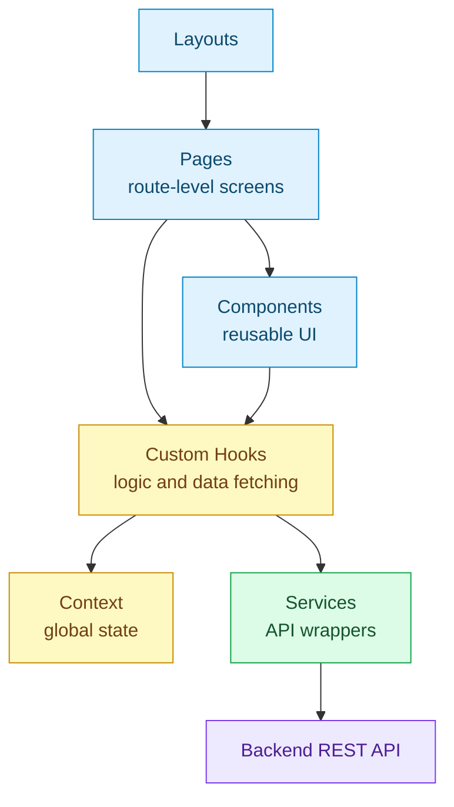

**One action, top to bottom.** When a user clicks Search, the page calls a hook, the hook calls a service, the service calls the API, and the result travels back up to update the screen.

---

## 6. App Startup and Routing

### Startup sequence

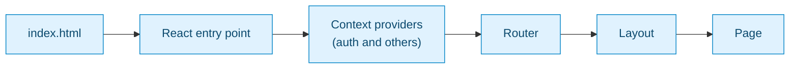

1. The browser loads `index.html`, which contains one empty container.
2. The React entry point mounts the app into that container.
3. Context providers wrap the app so every screen can read shared state.
4. The router picks a page based on the URL.
5. The matching layout frames the page.

### Route groups

Routes are organized by who is allowed to see them.

```mermaid
flowchart TD
    ROOT["Router"] --> PUB["Public routes"]
    ROOT --> PRIV["Protected citizen routes"]
    ROOT --> ADM["Admin routes"]

    PUB --> P1["Home and landing"]
    PUB --> P2["Login and registration"]

    PRIV --> C1["Find hospital and map"]
    PRIV --> C2["Hospital details"]
    PRIV --> C3["Feedback"]
    PRIV --> C4["Complaint reports"]
    PRIV --> C5["Health profile and records"]
    PRIV --> C6["Sharing and emergency card"]
    PRIV --> C7["Doctor services"]

    ADM --> A1["Admin dashboard"]
    ADM --> A2["Complaint management"]
    ADM --> A3["Analytics and AI insights"]
    ADM --> A4["Officers and audit logs"]
    ADM --> A5["Reports and export"]

    classDef pub fill:#dcfce7,stroke:#16a34a,color:#14532d;
    classDef priv fill:#e0f2fe,stroke:#0284c7,color:#0c4a6e;
    classDef adm fill:#ede9fe,stroke:#7c3aed,color:#4c1d95;
    class PUB,P1,P2 pub;
    class PRIV,C1,C2,C3,C4,C5,C6,C7 priv;
    class ADM,A1,A2,A3,A4,A5 adm;
```

| Group | Who can open it | Purpose |
|---|---|---|
| Public | Anyone | Landing content, login, registration |
| Protected citizen | Signed-in users | Discovery, feedback, complaints, health management |
| Admin | Signed-in administrators | Monitoring and management tools |

### Route guards

A guard wraps protected routes. It reads the auth state and decides whether to show the page or redirect.

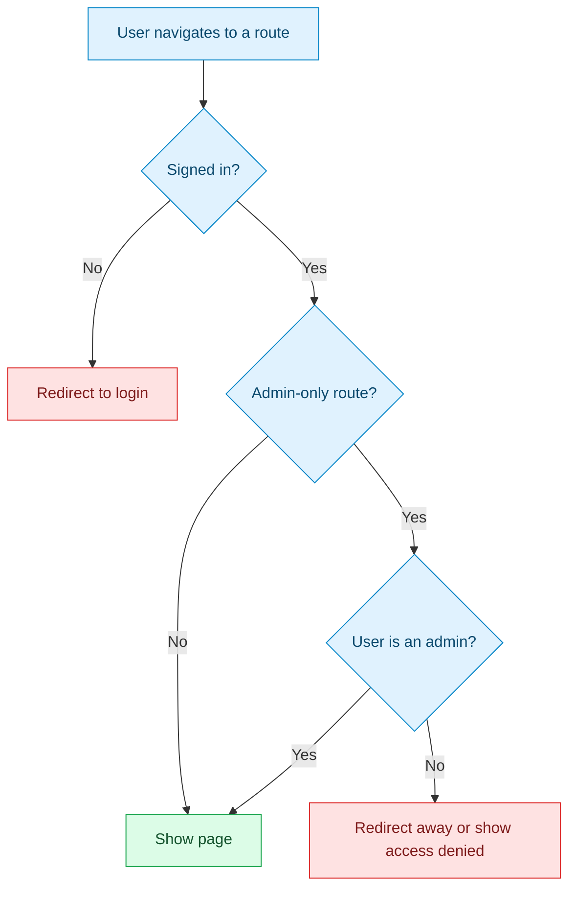

> Guards improve the experience only. The real protection is on the server, which checks the token and role on every protected request.

---

## 7. Layouts

Layouts are shells that stay constant while the page inside changes.

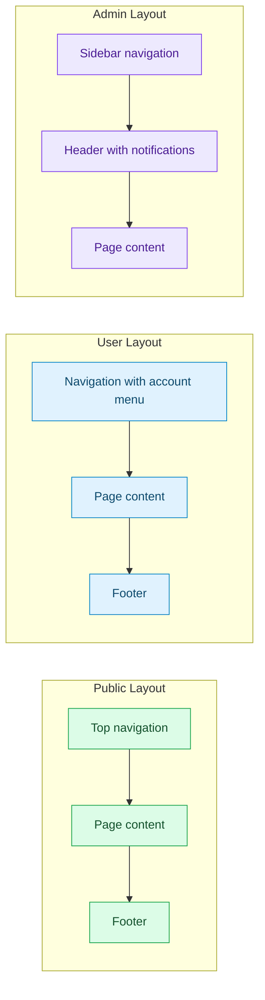

| Layout | Used by | Main elements |
|---|---|---|
| Public | Landing, login, registration | Top navigation, footer |
| User | All citizen screens | Navigation, account menu, footer |
| Admin | All admin screens | Sidebar, header with notifications |

---

## 8. State Management

Global state lives in **React Context**. Anything only one screen needs stays in that screen's own component state.

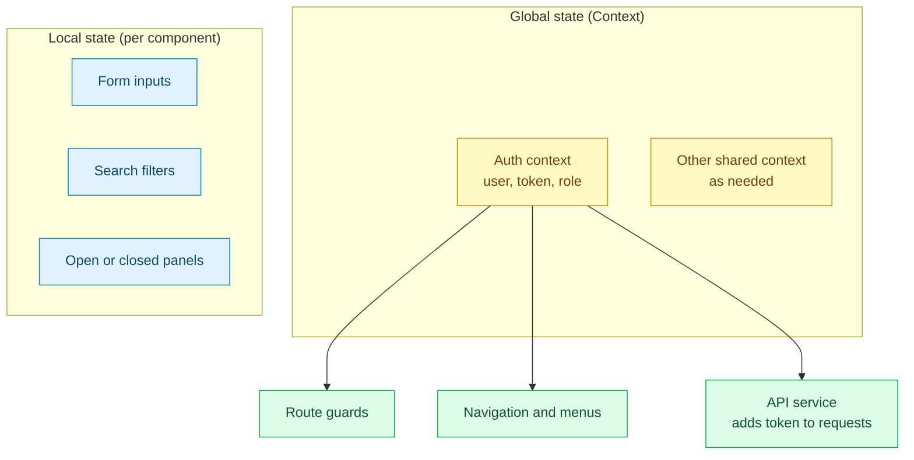

| State type | Where it lives | Examples |
|---|---|---|
| Global | Context | Signed-in user, role, session token |
| Server data | Hooks that fetch it | Hospital lists, reports, records |
| Local UI | Component state | Form fields, filters, modals |

### Authentication flow

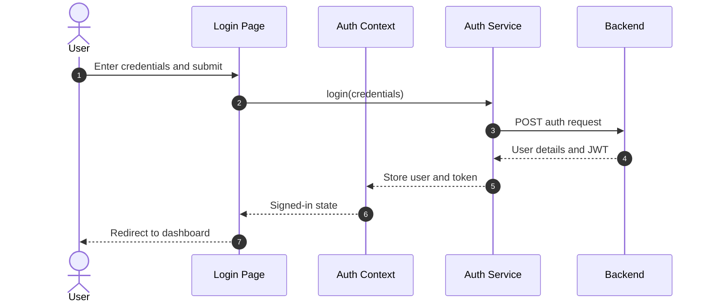

### Restoring a session on refresh

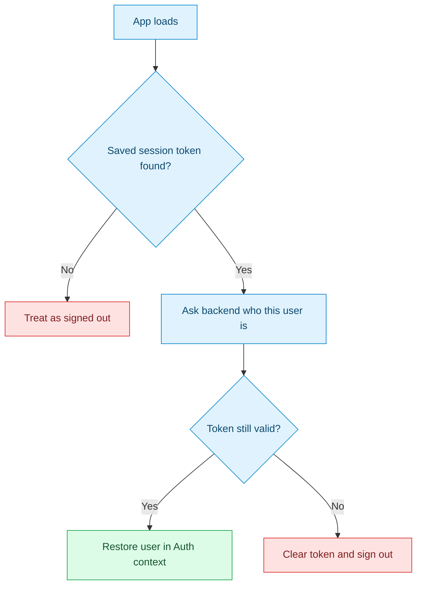

---

## 9. API Communication

All HTTP requests go through the **services** folder. Pages and components never call the network directly.

### Request lifecycle

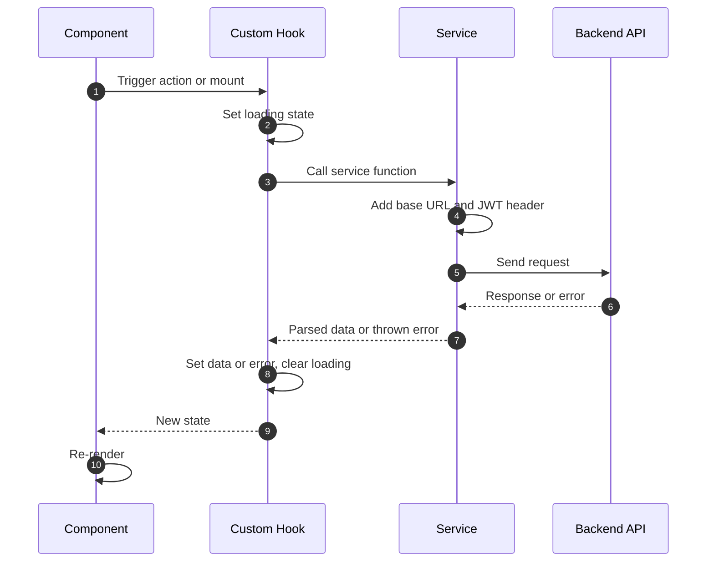

### Service map

Each service wraps one backend area.

| Service | Backend area | Used by |
|---|---|---|
| Auth service | `/api/auth` | Login, registration, session restore |
| Profile service | `/api/profile` | Health profile, emergency card |
| Records service | `/api/records` | Medical records, timeline, sharing |
| Reports service | `/api/reports` | Complaint submission and tracking |
| Hospital service | `/api/hospitals` | Search, nearby, details, map data |
| Review service | `/api/reviews` | Feedback and ratings |
| Admin service | `/api/admin` | Dashboard, analytics, officers, exports |
| AI service | `/api/ai` | Recommendations and insights |

### Error handling

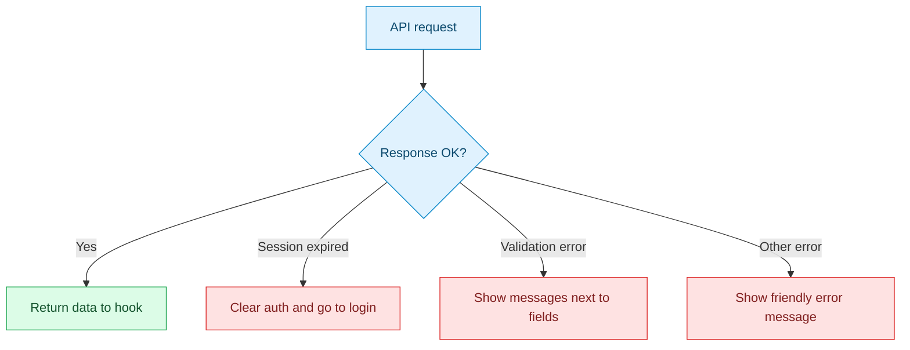

---

## 10. Feature Screens

This section explains how each screen works: what the user sees, what happens behind it, and which data it uses.

### 10.1 Login and Registration

**What it does.** Lets users create an account or sign in. After success the user lands on the dashboard, or the admin dashboard for administrators.

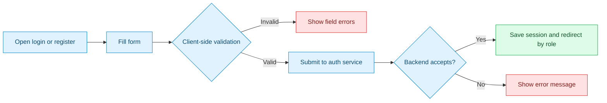

---

### 10.2 Find Hospital

**What it does.** Searches hospitals in several ways: nearby, by state, by district, by name, by pincode, and by department. All paths end in the same results view.

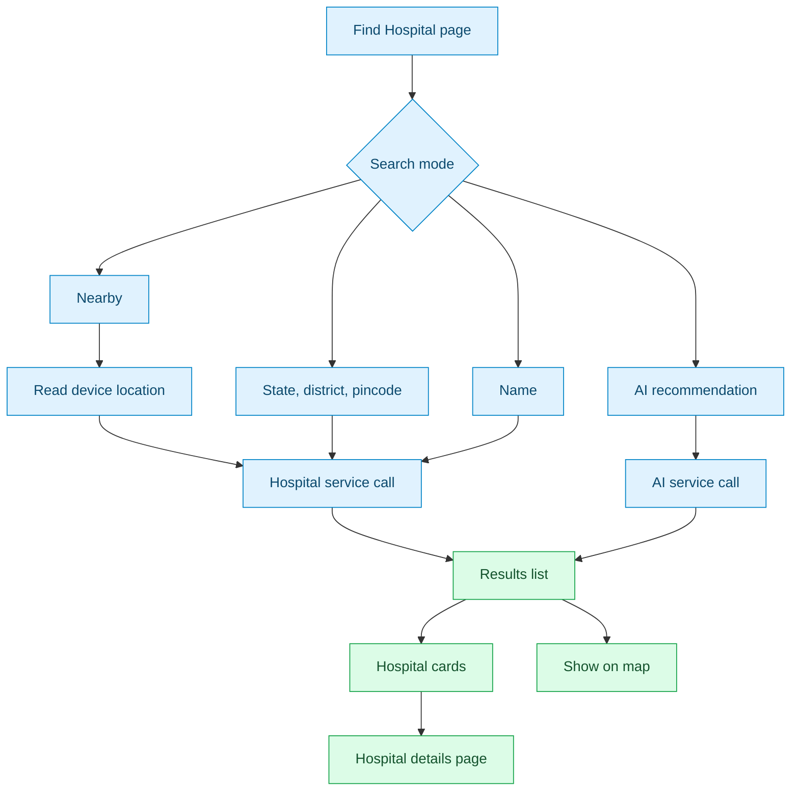

**Filter behavior**

| Filter | Behavior |
|---|---|
| State | Chosen first; unlocks district |
| District | Depends on the selected state |
| Pincode | Narrows to a postal area |
| Department | Narrows to a medical specialty |
| Name | Free-text search |

Filters can be combined. Changing a filter runs a new search and refreshes the results.

**Nearby search and location permission**

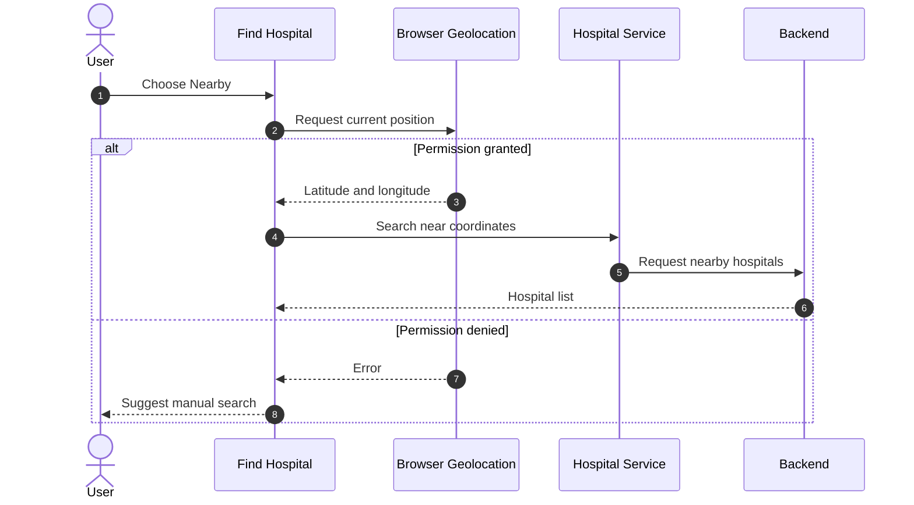

---

### 10.3 Interactive Hospital Map

**What it does.** Shows hospitals as markers on a Leaflet map. Marker colors show performance status, nearby markers group into clusters, and users can search and filter.

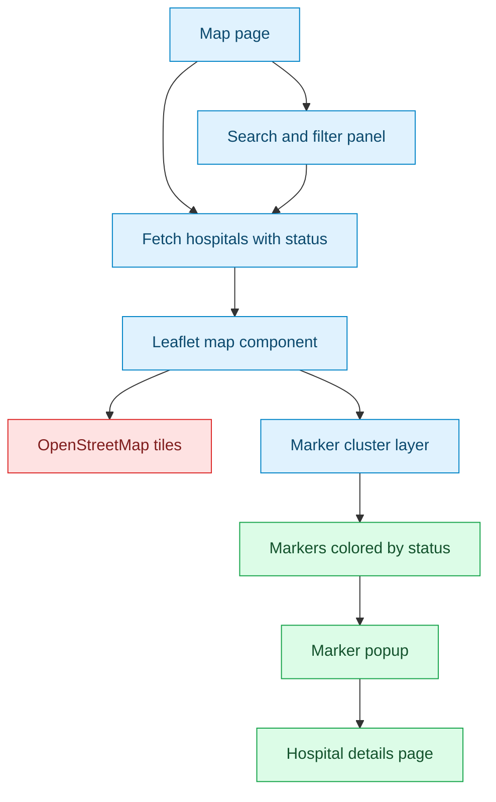

| Marker | Status | Meaning |
|---|---|---|
| 🟢 | Good | Performing well |
| 🟡 | Monitoring | Some concerns detected |
| 🔴 | Poor | Needs attention |

**Behavior notes**

- Zooming out groups nearby markers into a numbered cluster. Zooming in splits it apart.
- Clicking a marker opens a popup with a short summary and a link to the full details.
- Filters update the markers without reloading the page.

---

### 10.4 Hospital Details

**What it does.** Gathers everything about one hospital on a single screen and offers the next actions.

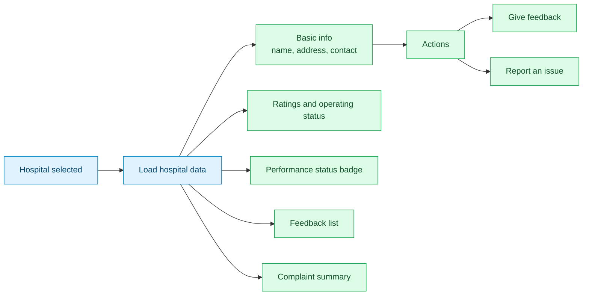

---

### 10.5 Hospital Feedback

**What it does.** A form for rating a hospital and describing the visit.

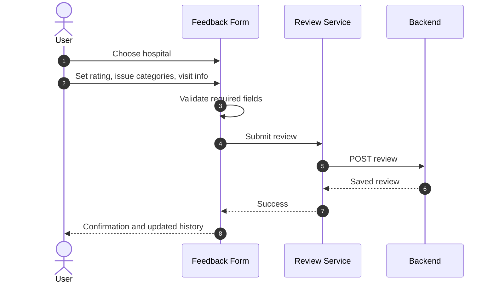

| Field group | Purpose |
|---|---|
| Hospital | Links feedback to the correct facility |
| Rating | Overall experience score |
| Issue categories | What went wrong, if anything |
| Visit information | Context for the visit |

The same area includes a **feedback history** list showing the user's earlier reviews.

---

### 10.6 Government Complaint Reports

**What it does.** Lets citizens submit complaints, follow their status, and review their history.

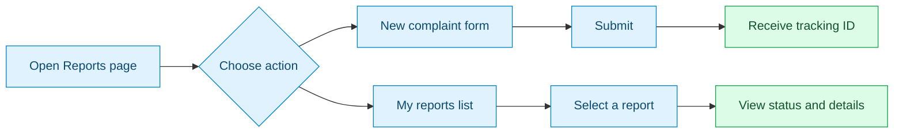

**Status display.** Each report shows its current status as a colored badge, together with its severity, so users can tell at a glance where it stands.

---

### 10.7 Personal Health Area

Five related screens make up the personal health area.

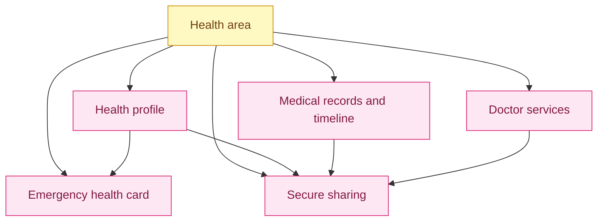

#### Health Profile

A sectioned, editable form covering personal information, vitals (blood group, height, weight, blood pressure), conditions, allergies, medications, medical history, lifestyle, and emergency information.

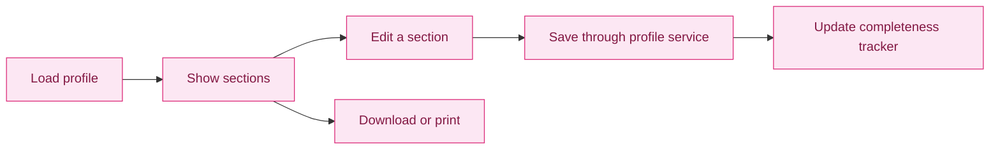

The **completeness tracker** shows how much of the profile is filled in, so users know what is still missing.

#### Medical Records and Timeline

```mermaid
flowchart LR
    A["Add record"] --> B["Choose type<br/>document, prescription, report"]
    B --> C["Save through records service"]
    C --> D["Record list"]
    D --> E["Health timeline<br/>ordered by date"]
    D --> F["Download or print"]

    classDef step fill:#fce7f3,stroke:#db2777,color:#831843;
    class A,B,C,D,E,F step;
```

#### Secure Sharing

```mermaid
sequenceDiagram
    autonumber
    actor Patient
    participant UI as Sharing Screen
    participant Svc as Records Service
    participant API as Backend

    Patient->>UI: Select information to share
    Patient->>UI: Select doctor or hospital
    UI->>Svc: Create share
    Svc->>API: Send selection
    API-->>Svc: Share created
    Svc-->>UI: Success
    UI-->>Patient: Show what is shared and with whom
```

#### Emergency Health Card

A compact, high-contrast card built from the health profile. It shows blood group, allergies, conditions, and emergency contact so the most critical facts can be read in seconds.

```mermaid
flowchart LR
    P["Profile data"] --> C["Emergency card component"]
    C --> F1["Blood group"]
    C --> F2["Allergies"]
    C --> F3["Conditions"]
    C --> F4["Emergency contact"]

    classDef step fill:#fee2e2,stroke:#dc2626,color:#7f1d1d;
    class P,C,F1,F2,F3,F4 step;
```

#### Doctor Services

```mermaid
flowchart LR
    A["Doctor list"] --> B["Filter by specialty"]
    B --> C["Doctor profile"]
    C --> D["Consultation workflow"]
    D --> E["Appointment"]

    classDef step fill:#fce7f3,stroke:#db2777,color:#831843;
    class A,B,C,D,E step;
```

---

### 10.8 Admin Dashboard

**What it does.** Gives administrators a single overview and quick access to every management tool.

```mermaid
flowchart TD
    AD["Admin dashboard page"] --> FETCH["Fetch summary data<br/>admin service"]
    FETCH --> W1["Key numbers<br/>complaints, hospitals, resolution"]
    FETCH --> W2["Charts<br/>trends, severity, categories"]
    FETCH --> W3["Attention-required hospitals"]
    FETCH --> W4["Notifications"]
    AD --> NAV["Sidebar navigation"]
    NAV --> M1["Complaint management"]
    NAV --> M2["Hospital comparison"]
    NAV --> M3["Analytics"]
    NAV --> M4["Officers"]
    NAV --> M5["Audit logs"]
    NAV --> M6["Reports and export"]

    classDef adm fill:#ede9fe,stroke:#7c3aed,color:#4c1d95;
    class AD,FETCH,W1,W2,W3,W4,NAV,M1,M2,M3,M4,M5,M6 adm;
```

#### Complaint Management, Officers, and Escalation

```mermaid
sequenceDiagram
    autonumber
    actor Admin
    participant UI as Complaint Screen
    participant Svc as Admin Service
    participant API as Backend

    Admin->>UI: Open complaint list
    UI->>Svc: Fetch complaints
    Svc->>API: Request
    API-->>UI: Complaints
    Admin->>UI: Assign officer or escalate
    UI->>Svc: Send update
    Svc->>API: PATCH complaint
    API-->>UI: Updated complaint
    UI-->>Admin: Refresh row and show confirmation
```

#### Analytics and Comparison

- Charts show complaint trends, severity, categories, resolution rates, and district-level analysis.
- The hospital comparison view lays hospitals side by side on the same measures.
- Changing a date range or filter re-fetches the data and redraws the charts.

#### Audit Logs and Export

- The audit log screen lists administrative actions in a searchable table.
- The export screen lets admins choose complaint or hospital data, apply filters, and download the result.

---

### 10.9 AI Insights

**What it does.** Displays the insights the backend produces from complaints and feedback: trends, repeated issues, and hospitals needing attention.

```mermaid
sequenceDiagram
    autonumber
    actor Admin
    participant UI as Insights Panel
    participant Svc as AI Service
    participant API as Backend

    Admin->>UI: Open insights
    UI->>UI: Show loading state
    Svc->>API: Request insights
    API-->>Svc: Insights and flagged hospitals
    Svc-->>UI: Data
    UI-->>Admin: Trend cards, repeated issues, attention list
```

Because generating insights can take longer than a normal request, the panel always shows a loading state and handles failure with a retry option.

---

## 11. Reusable UI Building Blocks

Shared components keep the interface consistent and reduce duplicated code.

```mermaid
flowchart LR
    subgraph SHELL["Structure"]
        S1["Navigation and sidebar"]
        S2["Footer"]
        S3["Route guard"]
    end

    subgraph INPUT["Input"]
        I1["Form fields"]
        I2["Filters and selects"]
        I3["Rating control"]
    end

    subgraph DISPLAY["Display"]
        D1["Cards"]
        D2["Status badges"]
        D3["Data tables"]
        D4["Charts"]
        D5["Map view"]
    end

    subgraph FEEDBACK["Feedback"]
        F1["Loader"]
        F2["Empty state"]
        F3["Error message"]
        F4["Alerts and confirmations"]
    end

    classDef a fill:#e0f2fe,stroke:#0284c7,color:#0c4a6e;
    classDef b fill:#fef9c3,stroke:#ca8a04,color:#713f12;
    classDef c fill:#dcfce7,stroke:#16a34a,color:#14532d;
    classDef d fill:#fee2e2,stroke:#dc2626,color:#7f1d1d;
    class S1,S2,S3 a;
    class I1,I2,I3 b;
    class D1,D2,D3,D4,D5 c;
    class F1,F2,F3,F4 d;
```

**Design rules**

- Components receive data through props and stay free of API calls.
- Anything used on more than one screen belongs in `components`.
- Status colors mean the same thing everywhere: green is good, yellow needs watching, red needs attention.

---

## 12. Loading, Empty, and Error States

Every screen that loads data handles the same five states, so users are never left looking at a blank page.

```mermaid
stateDiagram-v2
    [*] --> Idle
    Idle --> Loading: Action or page load
    Loading --> Success: Data received
    Loading --> Empty: No results
    Loading --> Error: Request failed
    Error --> Loading: Retry
    Success --> Loading: Filters change
    Empty --> Loading: Filters change
```

| State | What the user sees |
|---|---|
| Loading | A spinner or skeleton placeholder |
| Success | The data |
| Empty | A short message suggesting what to try next |
| Error | A clear message with a retry button |

---

## 13. Responsive Design

The layout adapts to the screen so the app works on a phone, a tablet, or a desktop.

```mermaid
flowchart LR
    W{"Screen width"} --> M["Mobile<br/>single column<br/>collapsible menu"]
    W --> T["Tablet<br/>two columns<br/>compact navigation"]
    W --> D["Desktop<br/>multi-column<br/>full navigation and sidebar"]

    classDef step fill:#dcfce7,stroke:#16a34a,color:#14532d;
    class W,M,T,D step;
```

| Device | Layout behavior |
|---|---|
| Mobile | Stacked content, menu collapses, tables scroll sideways, map fills the width |
| Tablet | Two-column grids, compact navigation |
| Desktop | Full navigation or sidebar, side-by-side panels |

---

## 14. Frontend Security Notes

| Topic | Practice |
|---|---|
| Access control | Route guards hide screens, but the server checks the token and role on every protected request |
| Secrets | Only `VITE_` variables reach the browser, so never store keys or passwords in them |
| Session token | Sent with each request, cleared on logout or expiry |
| Output safety | React escapes rendered text by default; avoid inserting raw HTML |
| Input validation | Validate in the browser for quick feedback, and rely on the server for real enforcement |
| Sensitive health data | Show only what the signed-in user is allowed to see, and avoid logging it in the browser console |

---

## 15. Adding a New Feature

Follow the same layered path every time.

```mermaid
flowchart LR
    A["1. Add a service function<br/>for the API call"] --> B["2. Add a custom hook<br/>for state and logic"]
    B --> C["3. Build components<br/>for the UI"]
    C --> D["4. Compose a page"]
    D --> E["5. Register the route<br/>and choose a layout"]
    E --> F["6. Add a guard if it is<br/>protected or admin-only"]

    classDef step fill:#e0f2fe,stroke:#0284c7,color:#0c4a6e;
    class A,B,C,D,E,F step;
```

**Checklist**

- [ ] The service is the only code that makes the request
- [ ] Loading, empty, and error states are handled
- [ ] The screen works on mobile and desktop
- [ ] Protected screens use the route guard
- [ ] Reused UI lives in `components`

---

## 16. Troubleshooting

| Problem | Likely cause | Fix |
|---|---|---|
| Requests fail with a network error | Backend is not running or the URL is wrong | Start the server and check `VITE_API_BASE_URL` |
| Browser blocks requests (CORS) | Server does not allow the client origin | Allow `http://localhost:5173` in the server CORS settings |
| Changes to `.env` do not apply | Vite reads env files only at startup | Stop and restart `npm run dev` |
| Redirected to login unexpectedly | Token expired or missing | Sign in again |
| Map is blank or grey | Map container has no height, or tiles are blocked | Give the map container a fixed height and check the network connection |
| Nearby search does nothing | Location permission denied | Allow location access in the browser, or use manual search |

---

<p align="center"><b>Swasth Setu Frontend</b>: making healthcare more transparent and accessible.</p>