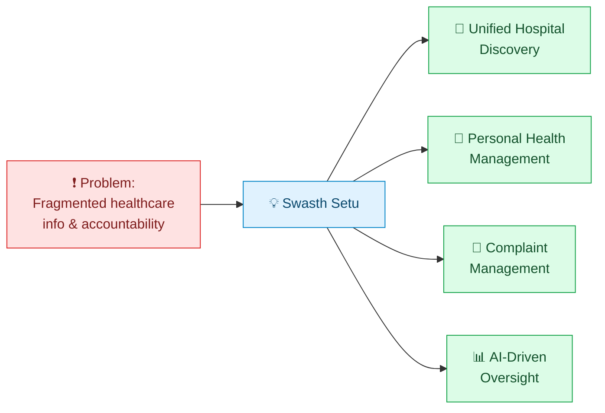
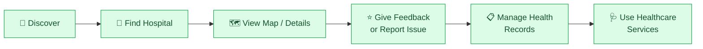
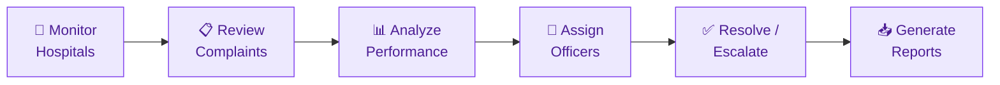

# 🎯 Problem Statement — Swasth Setu

> Government Healthcare Platform: Hospital Discovery, Personal Health Management & Complaint Monitoring

---

## 🧩 Background

Access to reliable healthcare information in India is fragmented. Citizens looking for a hospital, trying to raise a complaint about poor hospital service, or simply trying to keep their own health records organized end up relying on scattered sources — word of mouth, unofficial listings, paper records, or government offices that are slow and disconnected from each other. At the same time, government health departments lack a unified, data-driven way to monitor hospital performance and respond to citizen complaints before they escalate.

---

## ❗ The Problem

### For Citizens
- No single, trustworthy platform to **discover and compare hospitals** by location, department, or need
- No easy way to **report hospital-related issues** to the government and track what happens next
- **Personal health information** (conditions, allergies, medications, history) is scattered across paper files, apps, and memory — unavailable in an emergency
- No **quick, shareable emergency health summary** when time-critical decisions matter most
- Feedback about hospital experiences has **no structured home** — it's lost in reviews on unrelated platforms or not captured at all

### For Government Administrators
- **No centralized view** of hospital performance across districts and departments
- Complaints arrive without structure, making it hard to spot **repeated issues or hospitals needing attention**
- No systematic way to **assign, escalate, and track** complaint resolution
- Limited **data-driven insight** into complaint trends — decisions are reactive, not proactive
- No audit trail for administrative actions, reducing accountability

---

## 👥 Who Is Affected

| Stakeholder | Pain Point |
|---|---|
| 🧑 **Citizens & Families** | Struggle to find the right hospital and have no clear channel for complaints |
| 🚑 **Patients in emergencies** | Critical health info isn't accessible when seconds matter |
| 🏥 **Hospitals** | Genuine performance issues go unnoticed until they become large problems |
| 🏛️ **Government Health Officers** | Lack the tools to monitor, prioritize, and resolve issues efficiently |

---

## 🔍 Gaps in Existing Systems

- Hospital-finder apps exist, but rarely connect to a **government complaint or accountability system**
- Complaint systems (where they exist) are **manual, slow, and disconnected from hospital data**
- Personal health record apps exist in isolation — **not linked to hospital discovery or emergency access**
- Almost no existing solution gives administrators **AI-assisted insight** into complaint patterns across hospitals and districts

---

## 💡 Our Solution

**Swasth Setu** ("Health Bridge") brings hospital discovery, personal health management, and government complaint monitoring into **one connected platform** — so citizens get one place to find care and be heard, and administrators get one place to see the full picture and act on it.

---

## 🎯 Objectives

- Give citizens a **single platform** to discover hospitals, view performance, and give feedback
- Provide a **structured complaint pipeline** — from submission to resolution, with status tracking
- Let users maintain a **personal health profile and emergency card** accessible when it matters
- Equip administrators with **analytics and AI insights** to identify at-risk hospitals early
- Improve **accountability** through audit logs, officer assignment, and escalation tracking

---

## 🔄 Core User Flow

## 🏛️ Admin Flow

---

## 🌍 Expected Impact

- **Faster, more informed** hospital choices for citizens
- **Higher accountability** for hospitals through visible performance tracking
- **Quicker resolution** of genuine healthcare complaints
- **Data-backed decisions** for health administrators instead of guesswork
- A foundation for **safer emergencies**, with critical health info always within reach

---

> Swasth Setu isn't just a hospital finder or a complaint box — it's the missing bridge between citizens, hospitals, and the government bodies responsible for keeping healthcare accountable.