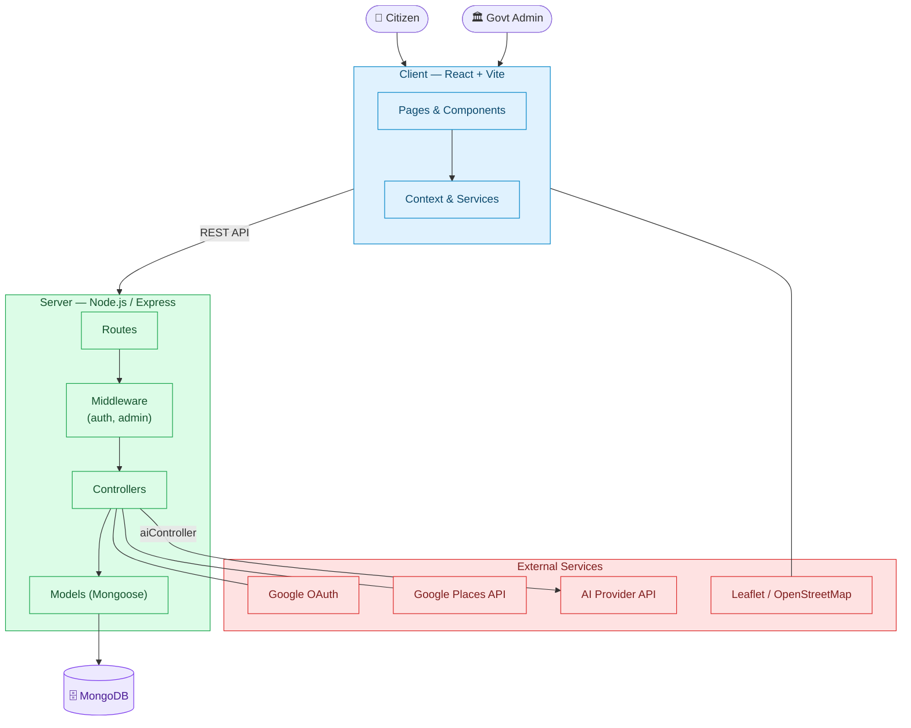
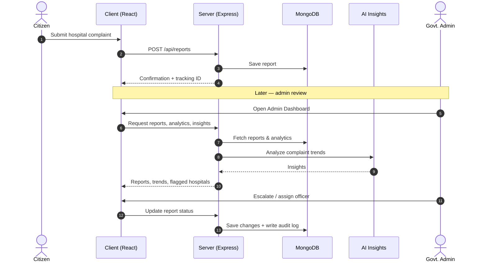
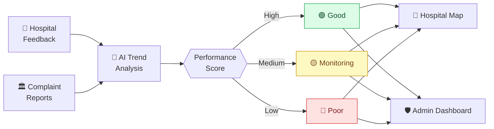

<p align="center">
  
</p>

# 🏥 Swasth Setu

**An AI-Powered Government Healthcare Discovery, Hospital Monitoring & Personal Health Management Platform**

Swasth Setu ("Health Bridge") connects citizens, hospitals, and government health administration on a single platform. It combines hospital discovery, interactive maps, personal health records, transparent complaint tracking, and AI-driven administrative insights.

<p align="left">
  
  
  
</p>

---

## 📖 Table of Contents

- [About the Project](#-about-the-project)
- [Key Features](#-key-features)
- [User Flows](#-user-flows)
- [System Architecture](#-system-architecture)
- [Tech Stack](#-tech-stack)
- [Project Structure](#-project-structure)
- [Data Flow](#-data-flow)
- [Getting Started](#-getting-started)
- [Environment Variables](#-environment-variables)
- [API Overview](#-api-overview)
- [Roadmap](#-roadmap)
- [Contributing](#-contributing)
- [License](#-license)

---

## 🎯 About the Project

Swasth Setu lets:

- **Citizens** discover hospitals, view them on a map, give feedback, report issues, and manage their personal health profile and medical records.
- **Government administrators** monitor hospital performance, review and escalate complaints, assign officers, and act on AI-generated insights.

The platform is built on the **MERN stack** with an **AI insights layer** for complaint trend analysis and hospital performance monitoring.

---

## ✨ Key Features

| Module | Highlights |
|---|---|
| 🔐 **Authentication** | Secure login/registration,  role-based access (citizen / admin) |
| 🏥 **Find Hospital** | Search via Google Places API by name, location, state, city, district, pincode, and department |
| 📍 **Interactive Map** | Leaflet + OpenStreetMap, hospital markers, clustering, search, filters, 🟢 Good / 🟡 Monitoring / 🔴 Poor performance indicators |
| 🏥 **Hospital Information** | Details, location, contact info, ratings, operating status, platform reports and feedback |
| ⭐ **User Feedback** | Reviews with ratings, issue categories, visit information, and feedback history |
| 🚨 **Government Reports** | Submit healthcare complaints, track status, severity, hospital issues, and resolution |
| 👤 **Personal Health Profile** | Personal info, blood group, height, weight, BP, conditions, allergies, medications, medical history, lifestyle, emergency info, completeness tracker |
| 📄 **Medical Records** | Documents, prescriptions, reports, health timeline, downloadable/printable profile |
| 🔗 **Secure Sharing** | Selectively share health information with doctors/hospitals with controlled access |
| 🚑 **Emergency Health Card** | Quick access to blood group, allergies, conditions, and emergency contact |
| 👨‍⚕️ **Doctor Services** | Doctor profiles, specialties, consultation workflow, appointment-related functionality |
| 🛡️ **Admin Dashboard** | Hospital monitoring, complaint management, hospital comparison, notifications, administrative management |
| 📊 **Analytics** | Complaint trends, severity, categories, resolution rates, hospital performance, district-level analysis |
| ⚠️ **Issue Monitoring** | Critical issues, repeated complaints, escalation, hospitals requiring attention |
| 👮 **Officer Management** | Assign complaints to officers and track workload/progress |
| 📋 **Audit Logs** | Track administrative actions and changes |
| 📥 **Reports & Export** | Export complaint and hospital data |
| 🤖 **AI Insights** | Complaint trend detection, repeated-issue analysis, and healthcare problem areas |

---

## 🔄 User Flows

**Citizen:**
`Discover → Find Hospital → View Map/Details → Give Feedback or Report Issue → Manage Health Records → Use Healthcare Services`

**Admin:**
`Monitor Hospitals → Review Complaints → Analyze Performance → Assign Officers → Resolve/Escalate Issues → Generate Reports`

---

## 🏗️ System Architecture



---

## 🧰 Tech Stack

| Layer | Technology |
|---|---|
| **Frontend** | React, Vite, Context API |
| **Backend** | Node.js, Express.js |
| **Database** | MongoDB (Mongoose) |
| **Auth** | JWT, role-based access |
| **Maps / Geo** | Leaflet, OpenStreetMap, Google Places API |
| **AI** | Prompt-driven insight generation via external AI provider |
| **DevOps** | GitHub Actions |

---

## 📁 Project Structure

```
swasth-setu/
│
├── client/                      # React frontend (Vite)
│   ├── src/                     # Pages, components, context, services
│   ├── index.html
│   ├── package.json
│   └── vite.config.js
│
├── server/                      # Express backend
│   ├── config/
│   │   └── db.js                # MongoDB connection
│   │
│   ├── controllers/             # Request handlers
│   │   ├── adminController.js
│   │   ├── aiController.js
│   │   ├── authController.js
│   │   ├── hospitalController.js
│   │   ├── profileController.js
│   │   ├── recordController.js
│   │   ├── reportController.js
│   │   └── reviewController.js
│   │
│   ├── middleware/
│   │   ├── adminMiddleware.js   # Admin-only access
│   │   └── authMiddleware.js    # JWT authentication
│   │
│   ├── models/                  # Mongoose schemas
│   │   ├── AuditLog.js
│   │   ├── HealthProfile.js
│   │   ├── Hospital.js
│   │   ├── HospitalReport.js
│   │   ├── MedicalRecord.js
│   │   ├── Report.js
│   │   └── Review.js
│   │
│   ├── routes/                  # API route definitions
│   └── package.json
│
├── .github/                     # CI/CD workflows
├── README.md
├── LICENSE
└── .gitignore
```

---

## 🔄 Data Flow

### Complaint Lifecycle — Citizen to Government Dashboard



### Hospital Performance Indicator Pipeline



---

## 🚀 Getting Started

### Prerequisites

- Node.js (v18+)
- MongoDB (local or Atlas)
- npm or yarn

### Installation

```bash
# Clone the repository
git clone https://github.com/ramanbhatia3/swasth-setu.git
cd swasth-setu

# Install server dependencies
cd server
npm install

# Install client dependencies
cd ../client
npm install
```

### Running Locally

```bash
# Start backend (from /server)
npm run dev

# Start frontend (from /client)
npm run dev
```

The client runs on `http://localhost:5173` and the server on `http://localhost:5000` (adjust per your config).

---

## 🔑 Environment Variables

Create a `.env` file inside `server/`:

```env
PORT=5000
MONGO_URI=your_mongodb_connection_string
JWT_SECRET=your_jwt_secret
GOOGLE_CLIENT_ID=your_google_oauth_client_id
GOOGLE_CLIENT_SECRET=your_google_oauth_client_secret
GOOGLE_PLACES_API_KEY=your_google_places_api_key
AI_API_KEY=your_ai_provider_api_key
```

And a `.env` file inside `client/`:

```env
VITE_API_BASE_URL=http://localhost:5000/api
VITE_GOOGLE_CLIENT_ID=your_google_oauth_client_id
```

> ⚠️ Never commit `.env` files. Make sure they are listed in `.gitignore`.

---

## 📚 API Overview

Each endpoint group maps to a controller in `server/controllers/`:

| Endpoint Group | Controller | Purpose |
|---|---|---|
| `/api/auth` | `authController` | Signup, login, Google OAuth |
| `/api/profile` | `profileController` | Personal health profile, emergency card |
| `/api/records` | `recordController` | Medical records, documents, timeline, sharing |
| `/api/reports` | `reportController` | Government complaint reports |
| `/api/hospitals` | `hospitalController` | Hospital search & details |
| `/api/reviews` | `reviewController` | Hospital feedback & ratings |
| `/api/admin` | `adminController` | Dashboard, analytics, officers, escalation, audit logs, exports |
| `/api/ai` | `aiController` | AI-generated insights |

Protected routes use `authMiddleware`; admin routes additionally use `adminMiddleware`.

---

## 🗺️ Roadmap

- [ ] Real-time notifications (WebSockets)
- [ ] Multi-language support
- [ ] Mobile app (React Native)
- [ ] Advanced predictive analytics for hospital performance
- [ ] Public API for third-party health integrations

---

## 🤝 Contributing

Contributions are welcome! Fork the repo, create a feature branch, and open a pull request with a clear description of your changes.

---

## 📄 License

This project is licensed under the **MIT License**. See the [`LICENSE`](./LICENSE) file for details.

---

<p align="center">Built with ❤️ to make healthcare more transparent and accessible.</p>