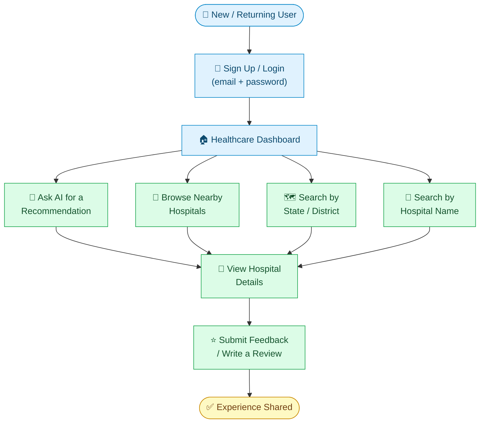
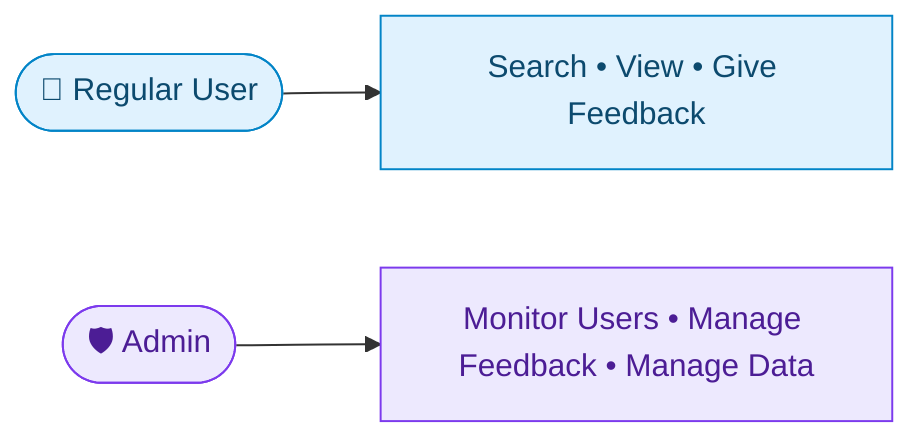

# 🧑‍💻 Swasth Setu — User Interaction Guide

> A quick look at how a user moves through Swasth Setu, from signing up to sharing feedback.

---

## 🔄 User Flow

---

## 🧭 Step-by-Step

| Step | What the User Does | What They Get |
|---|---|---|
| 1️⃣ | Signs up or logs in with email & password | A secure, personal session |
| 2️⃣ | Lands on the Healthcare Dashboard | Access to all discovery options |
| 3️⃣ | Picks a way to search — AI recommendation, nearby, state/district, or name | A relevant list of hospitals |
| 4️⃣ | Opens a hospital's details page | Location, contact, ratings, and past feedback |
| 5️⃣ | Submits feedback or a review | Their experience saved and linked to that hospital |

---

## 👥 Two Types of Users

A **regular user** discovers hospitals and shares feedback. An **admin** oversees the platform — users, feedback, and healthcare data — through a separate dashboard.